## Assignment 1 - Cartography - TA feedback

**CONTENTS**

- TOC
{:toc}

### Map from hell. Roast me ...

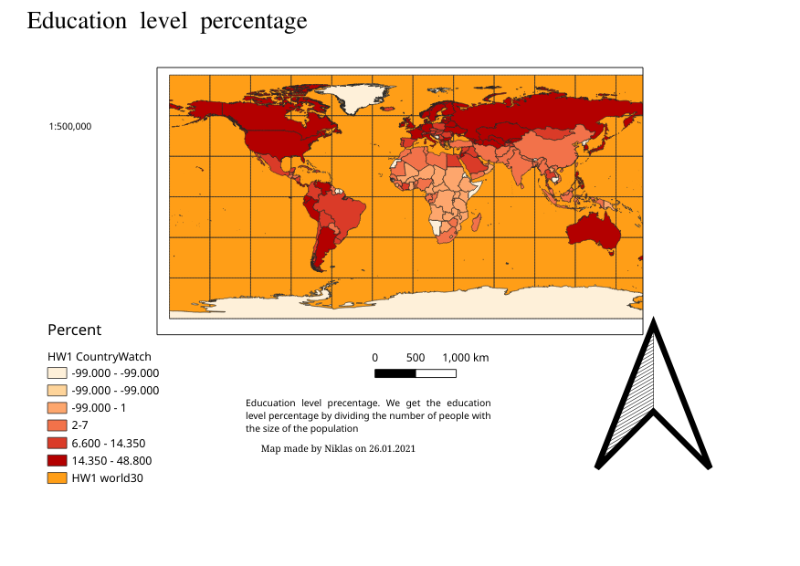

#### All thats wrong with it

- Colors
    - Is yellow-orange a good choice for ocean?
    - Should we draw yellow on yellow?
- Arrangement
    - Space wasted
    - No alignment
    - Irregular space inside frame
- Text
    - Incorrect and verbose.
    - Two different fonts
    - Serif font
    - Typo
    - non-ISO 8601 date
- Legend
    - Legend title useless
    - "No data" not displayed
    - "HW1 world30" (ocean) displayed
    - Bad choice of breaks: most of the world is in the same class
    - No truncated values
    - No rounded values
    - Unit is legend title, instead of next to values
    - "-" used instead of "to"
- Title
    - Title doesn't make a lot of sense
    - "Percentage" of what? should be share of population
- Scale
    - Scale bar
    - Scale
    - Comma used as thousand separator (in scale)
- Where is New Zealand?

### Common issues

#### Text

- Keep it brief.
- Keep the fonts consistent. Ideally, use a single font.
- Prefer sans-serif fonts.
- Don't make up stuff.

##### Avoid Tautologies:

> - "Energy consumption per capita is the total Energy Consumption in Millions of BTUs divided by population".
> - "Literacy ratio is the proportion of literate population to the total population. "

##### No need for overinterpretation

Don't overinterpret the data, especially when you don't have any sources to back up your claims. Your map may show population density, energy consumption, or life expectancy. All of this is interesting by itself. It is not the right place to write an interpretation of what might be the causes or consequences of those quantities.

Also, don't pad your descriptive text with stuff that's incomplete, or trivial common sense.

##### Be pragmatic in your writing

We typically prefer describing what something is rather than how it was created. Compare

> "Population Density was calculated by dividing the total population by the total area"

vs

> "Population Density is the population per area"

This also might be a bit too verbose:

> "Energy consumption per capita is the total Energy Consumption in Millions of BTUs divided by population".

##### Units in text

Ask yourself: How much information is a reader actually gaining from you mentioning the units you are using in the text, if you've already stated them in the legend?

#### Most of the world in same class

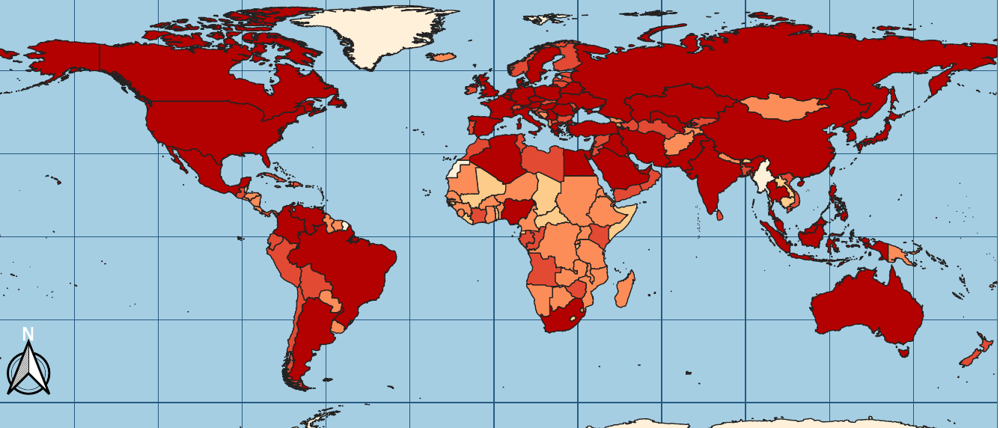

This might be exactly what you want. Just be sure you are intentional.

#### Dates

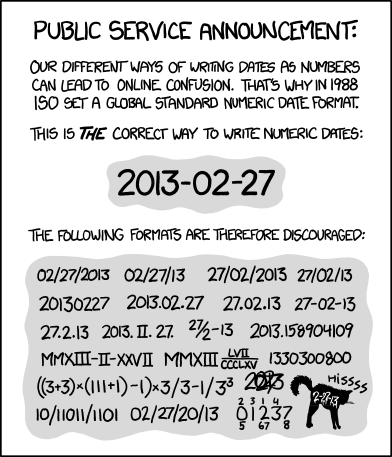

[XKCD1179](https://xkcd.com/1179/)

Stick with this date format, or you will eventually be struck by lightning.

#### Negative values in classes

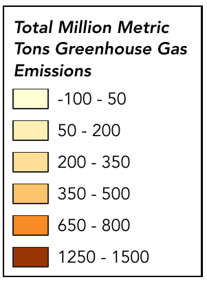

Oops. The metadata says -99 is No Data.

#### Frame gaps

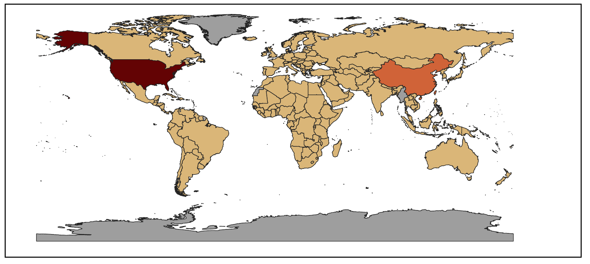

Check this page: [Margins and Frames](../../../general/margins_and_frames/index.md)

#### Gaps in the classes

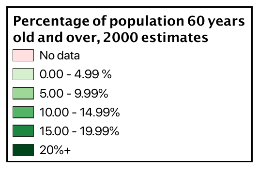

Which class is a country of a old population of 4.995% in?

Remember, classes in GISs are consistently "open at the bottom, closed at the top." Thus, given two classes 0–5 and 5–10, 5 is unambiguously in the first class.

#### Units

> This is a classic Niklas rave; you should count yourselves lucky to be experiencing it. /Frew

##### Stupid units

- Fight stupid units. Don't accept BTUs. Don't accept acre-feet, foot-pounds, pound-foots, PSI, horsepower, and any [United States customary unit](https://en.wikipedia.org/wiki/United_States_customary_units). Be angry, revolt, and make the world a better place.
    - "One BTU is the amount of heat required to raise the temperature of one pound of water by one degree Fahrenheit."
    - 1 BTU = 1.054 to 1.060 kJ (kilojoules) = 0.2931 W⋅h (watt hours) = 252 to 253 cal (calories) (calories are stupid too).

##### Convert units.

- [Metric prefixes](https://en.wikipedia.org/wiki/Metric_prefix) are cool
- 1000 kWh are a MWh. One billion kWh are a TWh.
- One thousand megatons (Mt) are a gigaton (Gt). One gigaton is a terragram (Tg).

##### Standards

- [ISO 31-0](https://en.wikipedia.org/wiki/ISO_31-0) is your friend.
    - Never put a unit into square brackets or parenthesis.
    - Space between value and unit (even for % and °C)
    - Sets and ranges are written as follows
        - 225 nm to 2400 nm
        - or (225 to 2400) nm.
        - but not: 225 to 2400 nm
        - [NIST Guide to the SI, Chapter 7](https://www.nist.gov/pml/special-publication-811/nist-guide-si-chapter-7-rules-and-style-conventions-expressing-values)

##### Don't forget your units

- The unit of population density is *reciprocal* area (e.g. km-2: "per square kilometer")

##### Tonnes

- A *tonne* is a metric tonne.

- Its abrevation is a minuscule letter t.

- [https://en.wikipedia.org/wiki/Tonne#Symbol_and_abbreviations](https://en.wikipedia.org/wiki/Tonne#Symbol_and_abbreviations)

  > The BIPM symbol for the tonne is t, adopted at the same time as the unit in 1879. Its use is also official for the metric ton in the United States, having been adopted by the United States National Institute of Standards and Technology (NIST). It is a symbol, not an abbreviation, and should not be followed by a period. Use of minuscule letter case is significant, and use of other letter combinations can lead to ambiguity. "T, MT, mT, Mt and mt are the SI symbols for the tesla, megatesla, millitesla, megatonne (one teragram), and millitonne (one kilogram) respectively."

#### Legends

- "percentage" vs ratio/share/fraction. Mind the difference between quantity and unit. "The amount of calories in a Bud Light is 100 kCal"
- If you display shares/ratios, add units (percentage) or display as fraction.
- Round and truncate values—three significant figures should suffice.
- Thousand separator:
    - Use non-breaking spaces instead of commas
    - Divide/multply by 1 000 as needed to simplify the presentation (e.g., 1 000 m vs 1 km)
- Title:
    - Your probably don't need to call the legend a "Legend".
    - Describe the physical quantity you're displaying.

#### North arrow

When adding map components such as a north arrow, ask yourself if you would expect this to provide additional helpful information for the viewer. A north arrow likely is superfluous in a context (e.g., whole Earth) where you would expect any viewer to know where north on the map is.

#### Colors

- There are so many colors out there. Does everything have to be blue? 😢 

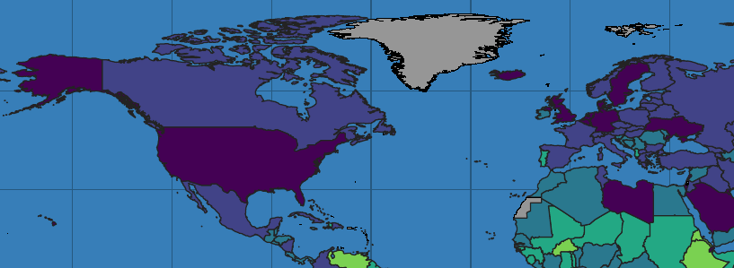

- Coloring waters in blue is probably a good idea

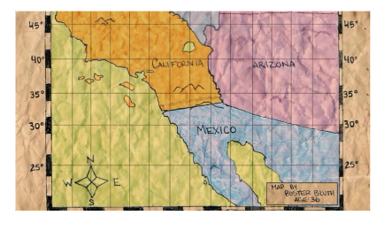

##### Diverging vs sequential

When deciding whether to use diverging or sequential color maps, consider [Lisa Charlotte Muth's Datawrapper blog](https://blog.datawrapper.de/diverging-vs-sequential-color-scales/):

1. Use a diverging color scale if there's a meaningful middle point
2. Use a diverging color scale to emphasize the extremes
3. Use a diverging color scale to let readers see more differences in the data
4. Use a *sequential* color scale for a more intuitive reading

###### A good use of Lisa's rule 1

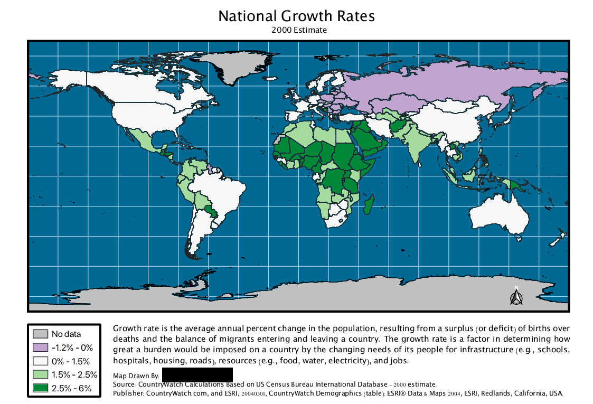

###### A good use of Lisa's rule 2

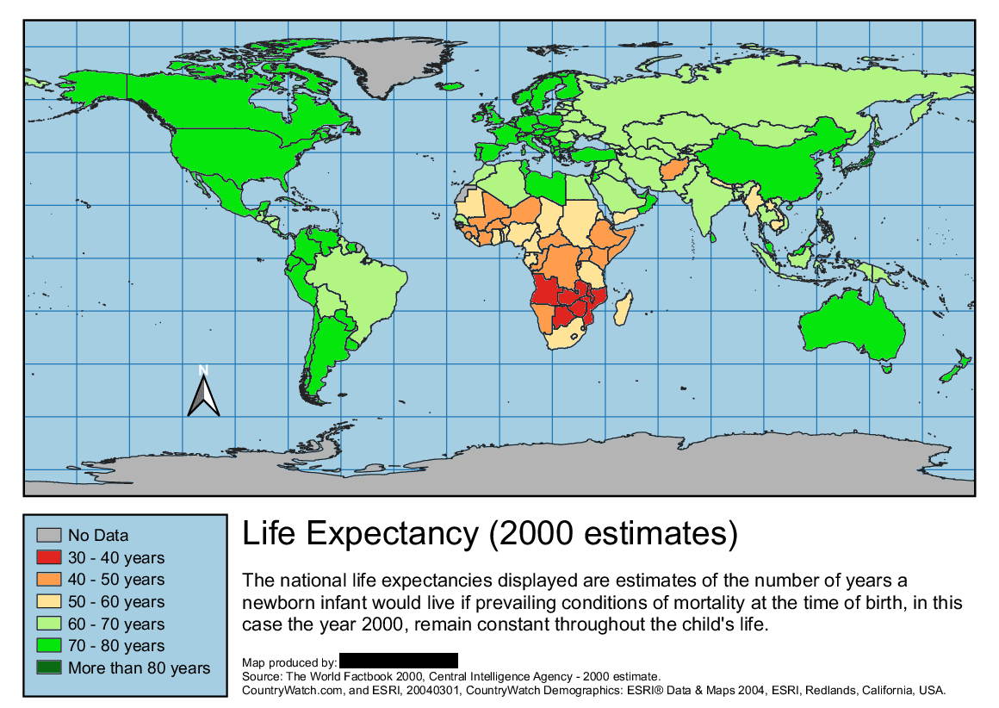

Other reads on the topic:

- [A quick intro by Cynthia Brewer herself](http://www.personal.psu.edu/cab38/ColorBrewer/ColorBrewer_learnMore.html)
- [When to Use Sequential and Diverging Palettes (Everyday Analytics blog)](https://everydayanalytics.ca/2017/03/when-to-use-sequential-and-diverging-palettes.html)

#### Stroke Width

Mind the *stroke width* of your features. In areas with very busy boundaries, the actual fill color becomes invisible if the stroke width is too large (for our world map data, examples might be Greece with its islands in the Aegis Sea, the Philippines, The Caribbean, or Tierra del Fuego)

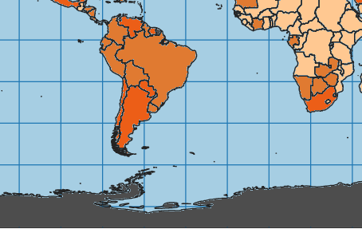

#### Scales and scalebar

- A *scalebar* will only be representing the distance at one given latitude  (e.g. the equator)
- *Representative fractions* (e.g., "1:10 000 000") don't make much sense on a digital artifact (consider zooming, printing, etc.)

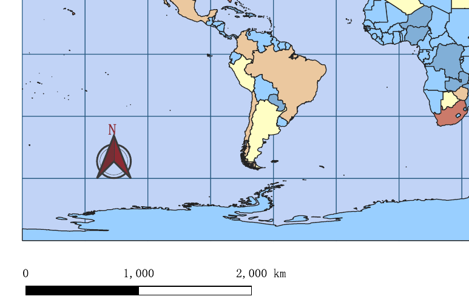

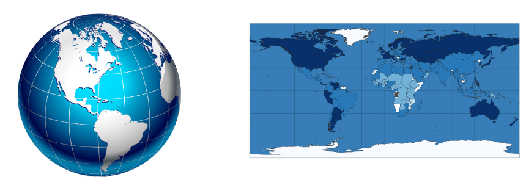

#### Various

- submit on time

#### Space

- Use the space you have wisely
- Why have the map in a small box? Use the full paper width

#### Great examples

1. 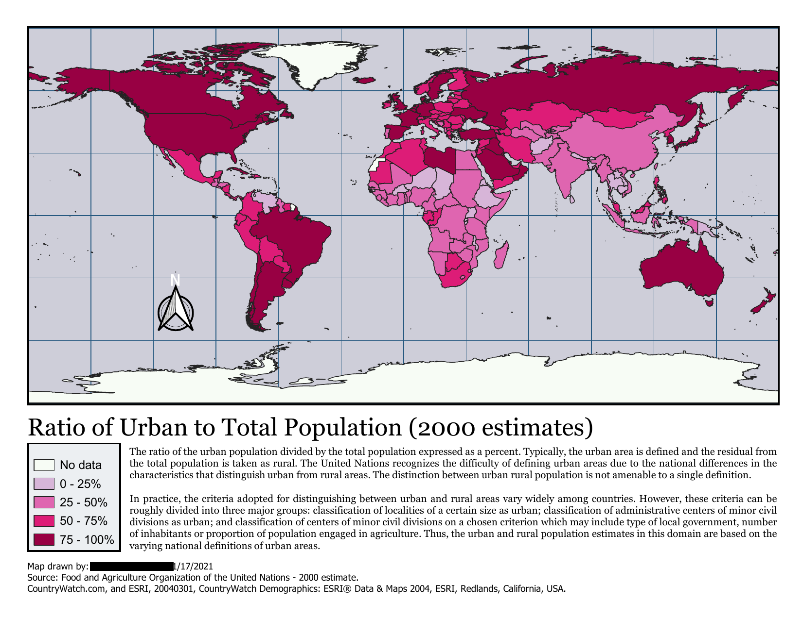

1. 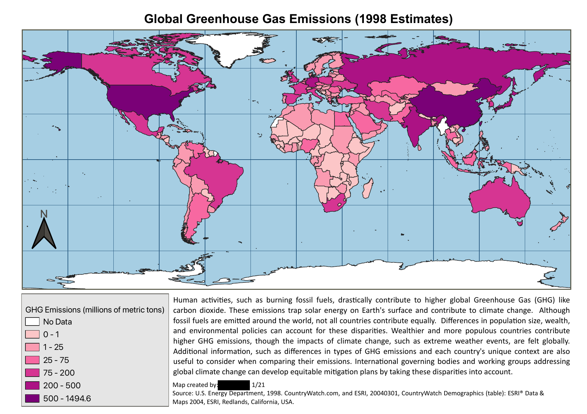

1. 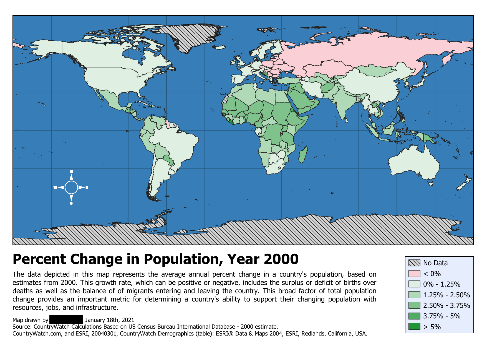

1. 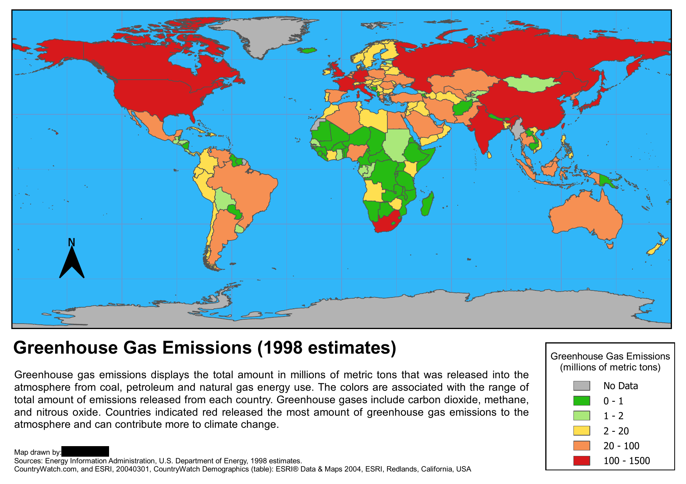

1. 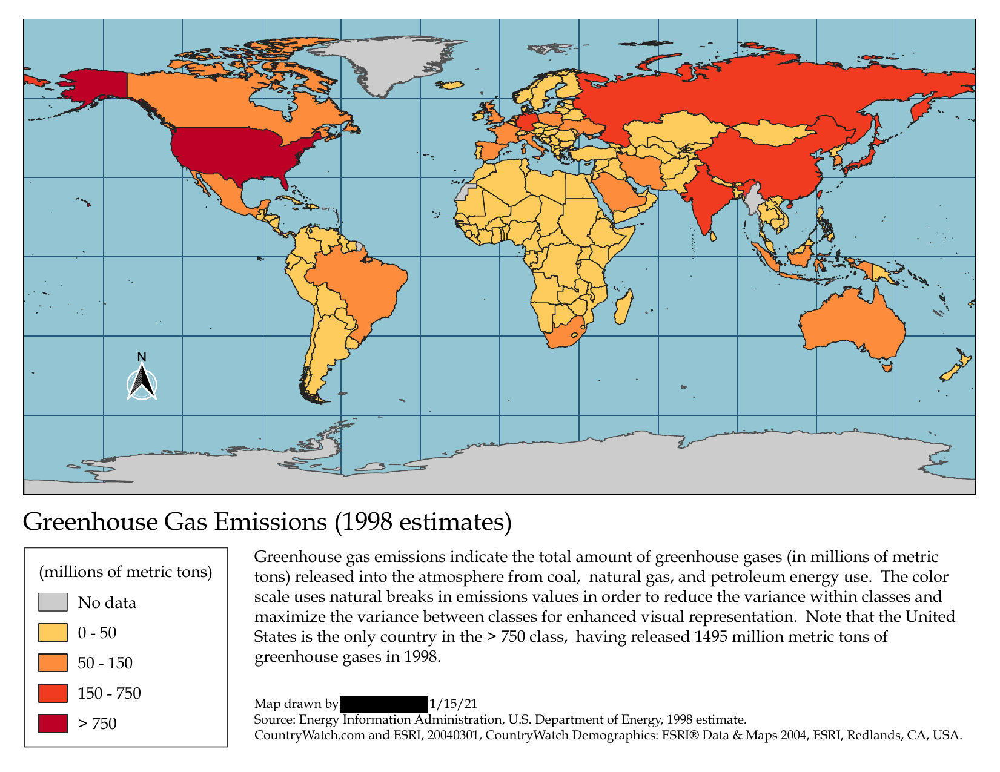

1. 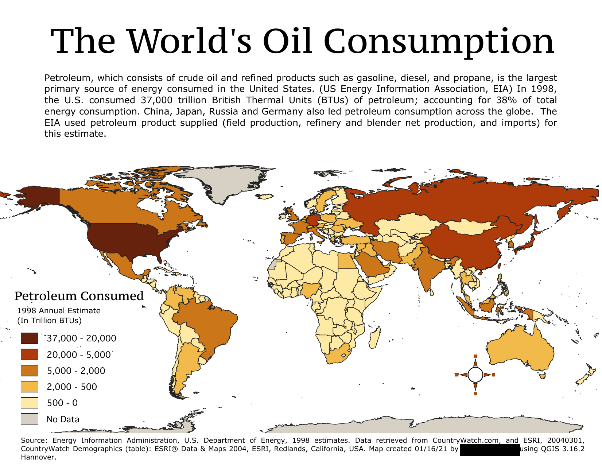
