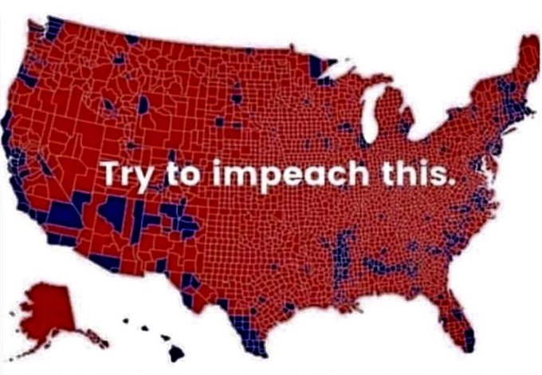

## Review of Homework 1

You all did a great job with your maps! It was fun to see the design choices that many of you chose. That is what cartography is all about, putting your personal stamp and style into the presentation of geographic data. There are some cartographic principles to consider when making your maps that we need to keep in mind though. Let's take a look at some using examples from your homework 1 submissions.

### Datums and Projections

Let's think back all the way to Week 2 when we talked about datums and projections. For Homework 1 we don't have to worry about datums too much because we aren't doing spatial analysis and are simply focusing on creating a nice looking map. For a refresher though, a datum is the model of Earth as an ellipsoid. We use an ellipsoid because Earth is not a sphere and has many imperfections (bumps, lumps, and dips). It can be difficult to perfectly represent this complex shape and datums try to create a best fit ellipsoid with reference points that "touch" the Earth. The most commonly used datum these days is WGS 84, which is what many of you used in your maps. Datums are still dealing with a round version of Earth not the 2D version we working with in QGIS. Some of you chose a different projection that changed the shape/area of the countries shown in your map. This resulted in some different and unique cartographic layouts (shown below).

As you can see, certain arrangments for your map are available if you simply use different projections. An important design consideration are the areas you want to highlight in your map. For example if you are want map readers to pay special attention to Africa, you should choose a projection that highlights that area. Thinking about what you are communicating to your reader is important and brings us to the next section.

### Map Communication

Good maps don't need a ton of explanation to get the point across. There are cartographic design choices that highlight certain information and can even be misleading. I'm sure many of you have seen voting district maps that can be misleading because they don't include population density (images from Bloomberg guide to misleading maps and Washington Post election maps telling you big lies about small things.). 

Similar things can happen with maps, though obviously not as nefarious. The design choices can communicate certain information that you may not intend based on your classification and color choices. The map below and to the left shows variation for energy consumption in Africa but the color choice and classification scheme does not show variation among more developed countries. The map below and to the right shows variation in more developed countries but African countries appear to all be very similar to each other. There is nothing wrong with either of these design choices but it is important for map makers to think about how their data is presented to a wider audience. Let's look at a few other examples of how color and classification choices can influence the data you are communicating in your maps.

#### Color Choices

The color palette you choose can certainly influence the ease of interpretation for your map. The palette you choose should work well with the number of classes you use in your classification scheme. If you choose a scheme that doesn't have strong contrast, the map may be a bit washed out and that makes it difficult to distinguish between classes. This is especially true when you are looking at global scale maps. Choosing a strong contrast can also give you flexibility as you settle on a classification scheme that best suits your purposes. The map to the left uses a color scheme with greater contrast between classes and it visualizes well on the map. The map to the right uses a good scheme but has a more muted color which doesn't make the differences stand out as well. Again, both maps are good but I want to point out these differences so we can think about them in future assignments.

Choosing between a single color scheme or a scheme with multiple colors also makes a difference. When using continuous data where the goal is to show the difference between small and large values, a single color scheme may be more appropriate because it intuitively makes sense. The color represents something like income where the lighter colors represent less money and the darker colors represent more money. The color staying the same indicates that we are still dealing with money in all the classes. If you use a scheme that changes color this principle doesn't hold and it looks like there is some sort of change happening. Like we are moving from poor to rich, which may not be the goal. An excellent example of when to use a changing color scheme is in the election  maps we looked at above. A move from red to blue shows a change in voting preference. The two maps below illustrate some examples (both good maps!) of different color schemes. It's also good to think about how color blindness can influence how people perceive your maps! There are a lot of good color schemes that take this into account. A good rule of thumb is to avoid red-green gradients.

#### Classification

The classification schemes you use like equal count, natural breaks, etc have are important considerations. They will show variation or homogeneity differently and you should be careful about which classification you choose. You want your map to be consistent with what you are trying to communicate without being dishonest (it can be easy to lie with maps). Using too few classes might hide important variation and too many classes can make it difficult to interpret your map. Aesthetics can be considered as well! If you aren't very concerned about each individual feature being interpreted, you can use a ton of classes to create a fun visualization! The images below show some examples. 

#### One last thing! The scalebar

Using a scalebar and using appropriate units is super important for most maps. In the case of a global extent, a scale bar isn't as important because it's such a huge scale. The reader knows the map covers very large distances. The projection you are in will also dictate the units used in your scale bar. Some of you may have noticed a scale bar in degrees that don't have a unit label. If you were in another projection, then you may have gotten a scale bar that scaled millions of kilometers. QGIS will often not even allow you to add a scale bar if are zoomed out too far because they know a scale bar won't be useful at that scale. Below is an example of the degrees scale bar for a WGS 84 projection.

