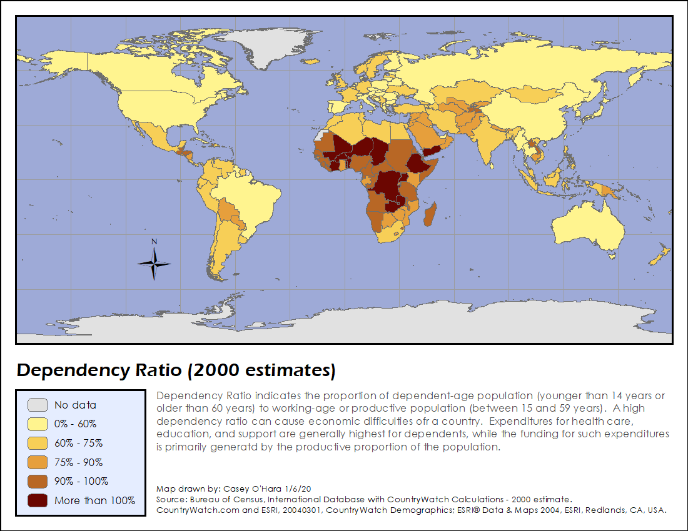
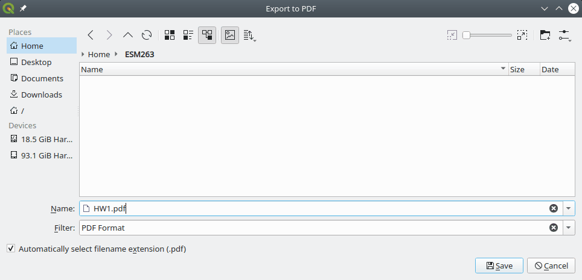
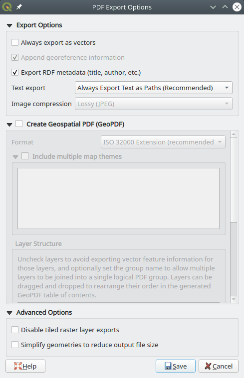

## Assignment 1 - Cartography

**CONTENTS**

- TOC
{:toc}

Due at **Fri 2023-01-20 23:59**

### Summary

1. Learn basic principles of cartography and map design.
2. Do the tutorial exercises to learn the basics of *QGIS*.
3. Design and construct a map using provided data.
4. Submit your assignment to course website.

### Grading

This assignment is worth **10 points** (10% of your grade), awarded according to [the scoring rubric](rubric.md). Your map should adhere to design principles, contain all appropriate design elements, and present data accurately.

### Tasks

#### Task 1: Principles of cartography and map design

Creating maps is one of the most common applications of GIS. A well-designed map is a powerful communication tool, but it takes practice and experience to master. You do not need any spatial analysis techniques for this assignment, but you do need to understand the core concepts and design principles behind mapmaking (i.e., cartography). We will discuss these principles in lecture and lab, and we've posted some readings on the course website. **Read** the [article from O'Looney](OLooney-Design.pdf), and focus on key principles—such as *map layers*, *map elements*, *visual variables*, *symbology*, and commonly used *map types* such as choropleth.

#### Task 2: Tutorials

You will learn the basics of QGIS to navigate and create maps via hands-on tutorials in the
Bolstad book.

1. Read the [excerpt from textbook Chapter 4, "Output: Hardcopy Maps, Digital Data, and Metadata"](GIS_Fundamentals_6e_ch4_excerpt.pdf).
1. On your own, **work** through "Lab 1: introduction to QGIS" from the textbook:

   1. Create a `lab1` folder in your `ESM263` course folder.
   1. Download the Lab 1 [handout](Lab_1_Introduction_to_QGIS/Bolstad_L1.pdf) and [data](Lab_1_Introduction_to_QGIS/Bolstad_L1.zip) into `ESM263/lab1`
   1. Unzip the data. This should result in the following folder structure:
      - `ESM263/lab1/`:
        - `Bolstad_L1/`: data
        - `Bolstad_L1.pdf`: handout

1. Read the following subsections of [section 15.1.3](https://docs.qgis.org/3.22/en/docs/user_manual/working_with_vector/vector_properties.html?highlight=classification#symbology-properties) of the QGIS manual on Features Rendering:
    - [15.1.3.1.1. Single Symbol Renderer](https://docs.qgis.org/3.22/en/docs/user_manual/working_with_vector/vector_properties.html?highlight=classification#single-symbol-renderer) 
    - [15.1.3.1.2. No Symbols Renderer](https://docs.qgis.org/3.22/en/docs/user_manual/working_with_vector/vector_properties.html?highlight=classification#no-symbols-renderer)
    - [15.1.3.1.3. Categorized Renderer](https://docs.qgis.org/3.22/en/docs/user_manual/working_with_vector/vector_properties.html?highlight=classification#categorized-renderer)
    - [15.1.3.1.4. Graduated Renderer](https://docs.qgis.org/3.22/en/docs/user_manual/working_with_vector/vector_properties.html?highlight=classification#graduated-renderer)
1. Work through QGIS training manual [3.3.3 - 3.3.4](https://docs.qgis.org/3.22/en/docs/training_manual/vector_classification/classification.html#moderate-fa-ratio-classification)

#### Task 3: Design a map

Design a map of the world that shows demographic information for each country.

> **Bonus:**
> 
> 1) Instead of using the provided dataset, you can find another dataset of your choice on the web and use it instead. Don't forget to reference the source!
>
> 2) Calculate ratios of the metrics, e.g. the population density.

1. Create a folder for your HW1 project, called, e.g. `HW1/`

1. Download the assignment data file [`HW1.zip`](HW1.zip).
This data was extracted from The [CIA World Factbook](https://www.cia.gov/the-world-factbook/) ([Extraction script](extract_cia.md))

1. Extract `HW1.zip` into your HW1 project folder. It should contain:
    - `world.gpkg`. A geopackage containing the outlines of the countries of the worlds and various metrics on these countries
    - `capitals.gpkg`. A geopackage containing the capitals of the world.
    - `bbox.gpkg`. A geopackage containing a bounding box of the world and 20 degree graticules.

1. Start up QGIS and save the new empty project as `ESM263/HW1/HW1.qgz`

    > The *Browser* panel will now contain a *Project Home* "folder" that serves as shortcut to `ESM263/HW1`

1. Add `world.gpkg` to your map  either by drag and dropping or by using *Layer→Add Layer*.

    > **Pro tip:** You could also just double-click on `world.gpkg` in the *Browser* panel. Doing this for anything that QGIS knows how to display will add it to your map as the top layer(s).
    
1. Optionally, add `capitals.gpgk` to your map. Decide if you want to display the capitals or not.
    
1. Take a look at the different metrics displayed at on the [CIA World Factbook Guide to Country Comparisons](https://www.cia.gov/the-world-factbook/references/guide-to-country-comparisons/) page. This contains the metadata for the *world.gpkg* data. Skim the different metrics and their descriptions.

1. Choose a metric to use for your map from the variables documented in the metadata. Examples include *Area*, *Population*. You may choose any variable (or calculate ratios of different variables). Use the *Attribute Table* of the *world* layer to view the data in tabular form.

    Here is an example map with *Title*, *Legend*, and *Acknowledgement* elements:

    

1. Design a map for your data, while considering these questions:

    - What is/are the source(s) for your data?

    - What are the units of your variable?

    - If your variable has a value of `-99`, what does that mean?

    - How will you describe your data in supporting map elements, such as a legend?

    - What is an appropriate symbology to communicate your data visually?

      > You might want to consult subsection [15.1.3.1.4. Graduated Renderer](https://docs.qgis.org/3.22/en/docs/user_manual/working_with_vector/vector_properties.html?highlight=classification#graduated-renderer) of the QGIS manual.

1. Lay out your map using the *Layout* tool (*Project→New Print Layout*). Include *Title*, *Legend*, and *Acknowledgment* elements. **Remember to include your name and your data sources.** For your page layout, use letter paper in landscape mode (11\" × 8.5\").

    Export your map as a PDF image by using *Layout→Export as PDF* (or click the *Export as PDF* button) and use `HW1.PDF` as the file name.

    

    **Un-**check *Simplify geometries to reduce output file size*:

    

1. Verify that your PDF document contains a clear and readable map.

#### Task 4: Turn-in your assignment

1. **Rename** your map image file to include your full name with proper capitalization and no spaces or punctuation ([Camel Case](https://en.wikipedia.org/wiki/Camel_case); e.g., from `HW1.pdf` to `HW1MortimerSnerd.pdf`.
2. **Create** a submission by uploading your map image file to the assignment page on the Canvas course website.

### Things to look out for

#### Design and layout

- \"No data\" symbology should be distinct (and subdued).
- When converting to quantile scale, your units change to rankings.
- Use sequential or divergent color ramps for intervals.
  - Check out [ColorBrewer in QGIS](..//../general/ColorBrewer/index.md).

- Limit unused layout space—zoom your data and arrange your elements accordingly.

#### Data sources and accuracy

- All information on your map should be *self-consistent*.
- Assume (for this course) that your audience is technical and that your map is going into a technical report, so err on the side of more detail than less.
- Incorrect or missing units—be precise, and adjust your units as needed.
- Lack of citation detail—be precise, and answer who, what, and when?
- Lack of attention to detail—poor or terse descriptions, typos, and spelling errors (QGIS does **not** have a spell checker)

#### Submission

- Follow the instructions closely for submitting your assignment, and **name your files accordingly**.
