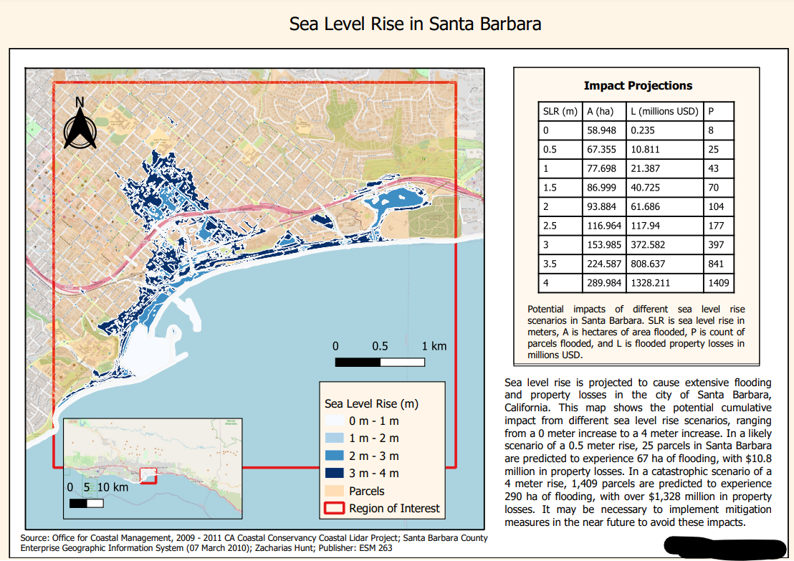
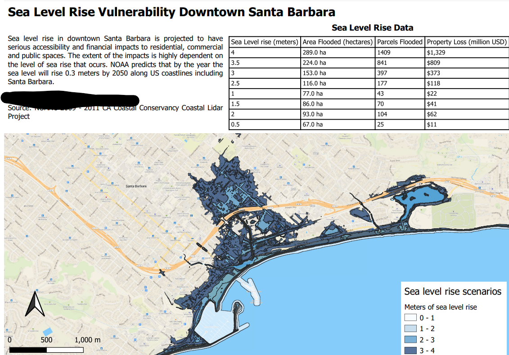
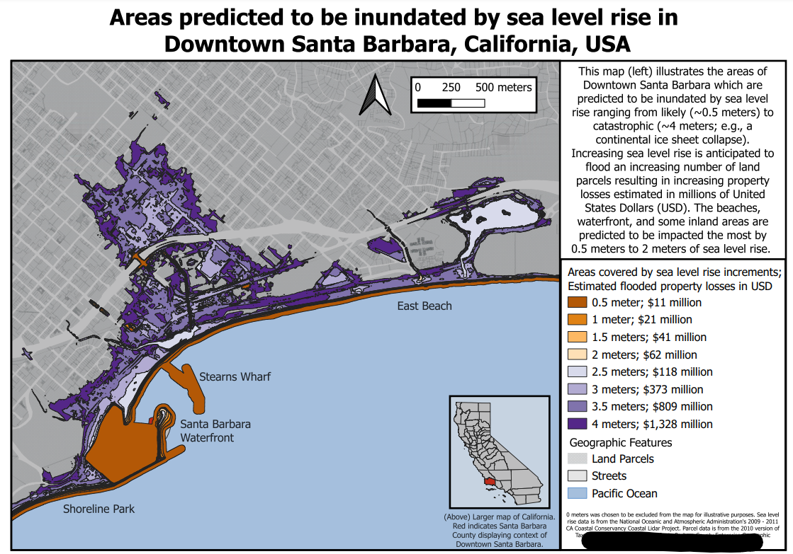

## Assignment 2 - Sea level rise in Santa Barbara - TA feedback
**CONTENTS**
- TOC
{:toc}
### You really listened to us

- [ISO 31-0](https://en.wikipedia.org/wiki/ISO_31-0)
- 1 m to 2 m
    - Remember: This is not an opinion. This is ISO. If anyone ever gives you grief for it, point to the standard.

- ISO 8601
- A lot of really good results ... you listened!

### Results

- Almost everyone got values correctly.
- If you didn't and want to know why, reach out.
- Always sanity check!
    - Are we in the right order of magnitude?
    - Are *trillions* of USD lost in SB realistic?
    - How large is my calculated area compared to SB county / California / USA / the world?
- Correct values:

    |Sea level Rise|Number of parcels lost|Area lost|Property Value Lost|
    |--:|--:|--:|--:|
    |0.0 m|8|59 ha|\$0.24 million|
    |0.5 m|25|67 ha|\$10.81 million|
    |1.0 m|43|78 ha|\$21.39 million|
    |1.5 m|70|87 ha|\$40.73 million|
    |2.0 m|104|94 ha|\$61.69 million|
    |2.5 m|177|117 ha|\$117.94 million|
    |3.0 m|397|154 ha|\$372.58 million|
    |3.5 m|841|225 ha|\$808.64 million|
    |4.0 m|1409|290 ha|\$1328.21 million|

- [Note on table formatting](table_formatting/index.md)

### Issues

#### Export as CSV

- You can select the fields you want to export

#### Sanity Check

##### Area

Remind yourself how big a hectare is: 100 m x 100 m; e.g., same order-of-magnitude as a football field. Now how big do you think downtown SB is? Definitely more than one of those football fields. Definitely less than 1 000 000 of them.

##### Money

Compare your values to California's, or the US's, GDP.

#### Locator map

- What is a locator map?
    - "A locator map, sometimes referred to simply as a locator, is typically a simple map used in cartography to show the location of a particular geographic area within its larger and presumably more familiar context." [[https://en.wikipedia.org/wiki/Locator_map](https://en.wikipedia.org/wiki/Locator_map)]
- "Include a locator map if the map frame's extent is not obvious to its intended audience."
    - ... Who is your audience if you chose not to include one?
- Still confused? Here is a nice tutorial on [qgistutorials](https://www.qgistutorials.com/en/docs/making_a_map.html).

#### How to write monetary values

- millions(\$), Million USD, M\$, Millions USD, \$ millions
- There is no ISO standard.
- But some kinda sorta consensus:
    - [first Google hit](https://www.avidcareerist.com/2014/01/06/how-to-abbreviate-million-on-your-resume/)
    - [some opinions on StackExchange](https://english.stackexchange.com/questions/197642/how-to-express-1m-in-a-formal-document)
- As an engineer, you might get away with saying "1 kUSD", "1 MUSD" or "1e9 USD". Maybe even "\$1M" etc.
- But what we more commonly see in e.g. Forbes magazine would be "\$1 million".
- Don't use "m" as that is the metric prefix for "milli"!
- If you cannot find a standard, seeing how someone who you respect does it is often a good idea.

#### Million USD

We asked you to present in million USD. We did not do this just for fun. Look at how hard it is to read a value like this: \$1328211519. We have to put our dirty fingers onto the computer screen to count the digits to see if we are talking millions, or tens of millions. Orders of magnitude should always clearly be readable.

#### Unit placement

Put the units behind the values, not into the column headings or the legend title.

#### Right justify numbers

Which column allows you to mentally sort the values the fastest?

|FID|Left Align|Center Align|Right Align (varying precision)|Right Align (constant precision)|
|:--|:--|:-:|--:|--:|
|**A**|10.534 km|10.534 km|10.534 km|10.53 km|
|**B**|1.3 km|1.3 km|1.3 km|1.30 km|
|**C**|256.1 km|256.1 km|256.4 km|256.40 km|
|**D**|0.1443 km|0.1443 km|0.1443 km|0.14 km|
|**E**|1431 km|1431 km|1431 km|1431.00 km|
|**F**|13.3212 km|13.3212 km|13.3212 km|13.32 km|

#### Colors

##### California Island

If you draw a blue background around your California locator map, it might look like California is an island.

##### Color ramp

Make sure the different scenarios are clearly visible by tweaking the color ramp.

#### Texts

- Some of you did great jobs; you critically thought about what's going on and expressed it effectively.

- If you don't feel like doing that, cut back on the writing. Better to say less than to be verbose and imprecise.

- Don't confuse *what* you are displaying with *in what units* you are expressing it. There is almost never a need to describe what units you are using in your descriptive text. That goes for reports as well!

- No need to use text like this:

  "Sea-level inundation scenarios represent increasing sea levels for 1m (yellow) to 10m (dark blue)"

  to describe what should be obvious from the legend.

#### Values and units

- You can use standard abbreviations (e.g. m instead of meter); they will be understood in the context.
- Remember to use non-breaking space between a value and its unit. Read ISO 31-0!
- Watch out with those decimal places—round them, either to integers, or at least to 1 or 2.
  - If there are 3 decimal places, I might for a second ask myself if the "." is a thousand separator. Round to one or two instead to make it less ambiguous.

- Use appropriate units for large quantities (e.g., km instead of m). Use scientific notation if the values are still too large to read easily.

#### Number Ranges

[Section 7.7 of NIST Guide to the SI, Chapter 7: Rules and Style Conventions for Expressing Values of Quantities](https://www.nist.gov/pml/special-publication-811/nist-guide-si-chapter-7-rules-and-style-conventions-expressing-values):

The value of a quantity is expressed as the product of a number and a unit. To avoid possible confusion, the Guide takes the position that:
- values of quantities must be written so that it is completely clear to which unit symbols the numerical values of the quantities belong.
- the word "to" to be used to indicate a range of values for a quantity instead of a range dash (that is, a long hyphen) because the dash could be misinterpreted as a minus sign.

|good||bad|
|:--|:--|:--|
|51 mm × 51 mm × 25 mm|but not:|51 × 51 × 25 mm|
|225 nm to 2400 nm or (225 to 2400) nm|but not:|225 to 2400 nm|
|0 ºC to 100 ºC or (0 to 100) ºC|but not:|0 ºC – 100 ºC|
|0 V to 5 V or (0 to 5) V|but not:|0 – 5 V|
|(8.2, 9.0, 9.5, 9.8, 10.0) GHz|but not:|8.2, 9.0, 9.5, 9.8, 10.0 GHz|
|63.2 m ± 0.1 m or (63.2 ± 0.1) m|but not:|63.2 ± 0.1 m or 63.2 m ± 0.1|
|129 s – 3 s = 126 s or (129 – 3) s = 126 s|but not:|129 – 3 s = 126 s|

#### Classes/ranges; break points

- There are 10 scenarios;
    - Either you name the scenarios by the sea level rise (1 m through 10 m)
    - Or with ranges from 0 m to 1 m through 9 m to 10 m.

    |Sea level Rise|Areas flooded at elevation of|
    |--:|--:|
    |1 m|0 m to 1 m|
    |2 m|1 m to 2 m|
    |3 m|2 m to 3 m|
    |4 m|3 m to 4 m|
    |5 m|4 m to 5 m|
    |6 m|5 m to 6 m|
    |7 m|6 m to 7 m|
    |8 m|7 m to 8 m|
    |9 m|8 m to 9 m|
    |10 m|9 m to 10 m|

### Some nice examples

---

---

---

---

---

---

---

---

---

---

