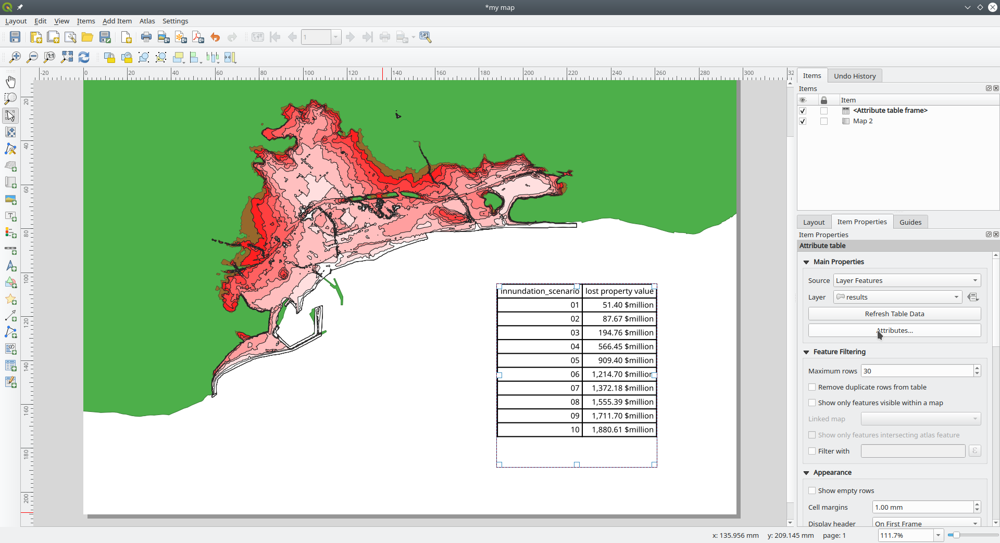
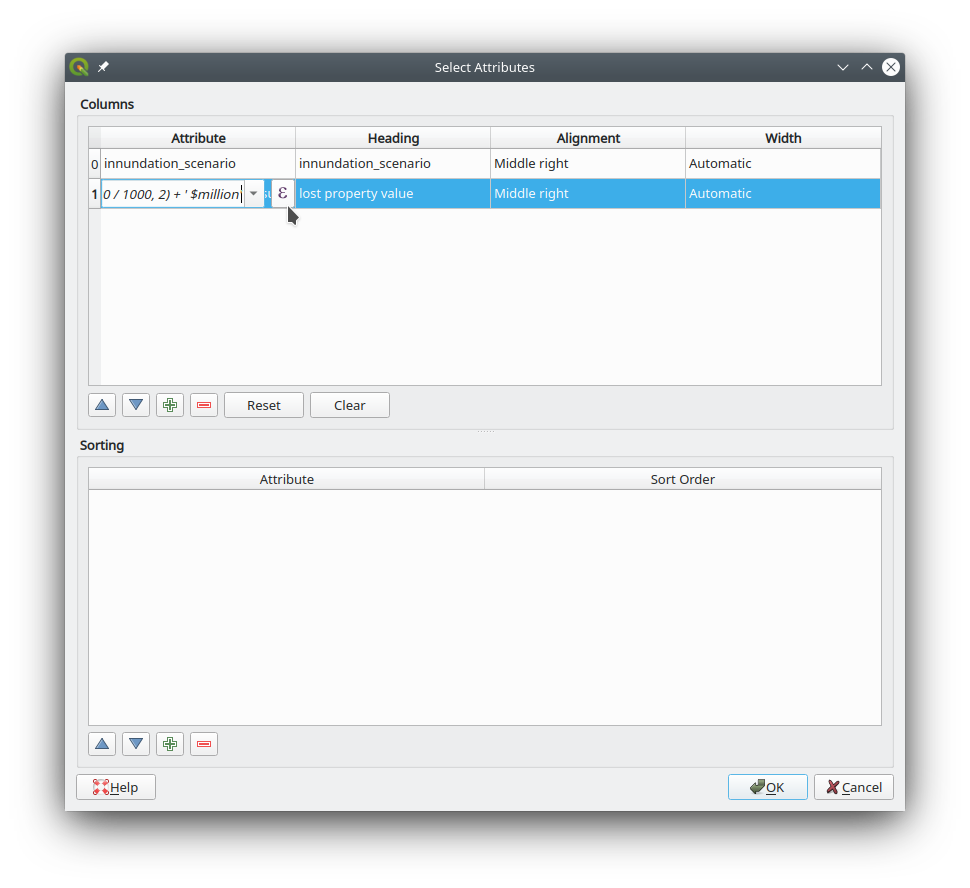
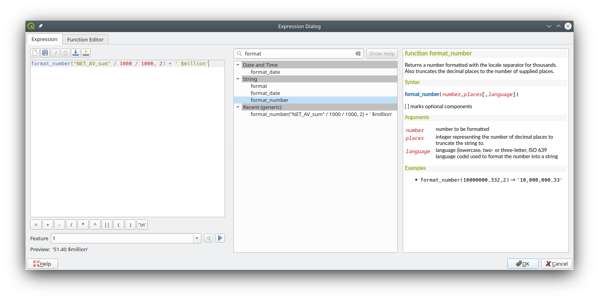

## Formatting tables

In an ideal world, a table would look like this:

|Sea level Rise | Number of parcels lost | Property Value Lost | Area lost |
| --:           | --:                    | --:                 | --:       |
|1 m            | 60                     | $51 million         | 11 ha     |
|2 m            | 89                     | $88 million         | 31 ha     |

Formatting a table like this in Q is possible. You may either choose to add a field/column with the field calculator that contains your perfectly formatted column, or you can edit the table that you added to your map document.

You will need one simple function: `format_number()`, which "Returns a number formatted with the locale separator for thousands. Also truncates the decimal places to the number of supplied places."

> Syntax
> `format_number(`*number, places[, language]*`)`
>
> [ ] marks optional components
>
> Arguments
>
> *number*: number to be formatted
> *places*: integer representing the number of decimal places to truncate the string to.
> *language*: language (lowercase, two- or three-letter, ISO 639 language code) used to format the number into a string
>
> Examples
> `format_number(10000000.332,2)` → '10,000,000.33'

### Step 1

1. Add a table to your layout
2. Open the attributes of the table

### Step 2
1. Remove all fields/columns you don't want to display
2. Right-align all columms containing numeric data
3. Change the headings to something human-intelligible
4. Add an expression

### Step 3

1. Use the function `format_number()` to set the number of decimal places (and convert the decimal and thousand separator).
   - NB: There does not seem to be a language you can set so the number actually becomes ISO31-0-compliant.

2. The `format_number()` function produces a string, to which you can now manually add the unit.

