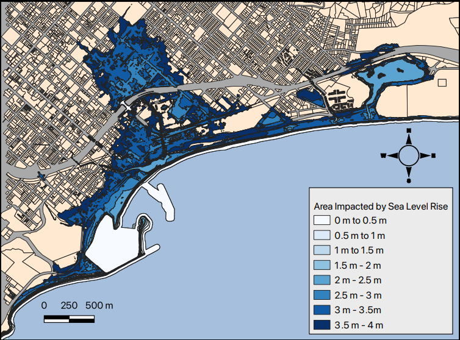

```{r, setup, include=FALSE}
#knitr::opts_knit$set(root.dir = "02/feedback_Sean")
```

## Improvements from Homework 1

You all improved from the first assignment! It was really great to see the work you all put into this assignment and how you are progressing with your GIS skills. It makes me excited to what the next two assignments are going to look like :). Here are a few feedback items from Homework 1 that many of you fixed/improved on in Homework 2:

* Following ISO standards!
  * Using "to" to indicate ranges instead of a dash ("-")
    * 1m to 2m (good!) instead of 1m - 2m (not as good)
* Including scale bars and north arrows. These elements should be in nearly every map you make. The scale bar is particularly important and can be easy to mess up. Make sure you check your units.
* Keeping the legend in our out.
  * In Homework 1 many of you overlapped the legend in and out of the map frame. This can give your map a disjointed and cluttered appearance. You want to keep your legend all the way in or all the way out of your map frame.
* Your use of colors improved vastly. Homework 2 was a tough color/classification problem! Many of you gave this some serious thought and chose excellent color schemes with great contrast.


## Results

* Almost all of the values were correct, that means everyone followed the analytical steps in the instructions well! Whoooo!!
  * Please reach out if you have any questions about this.
  
* Make sure that your values make sense in terms of magnitude.
  * Is trillions of dollars realistic for damage? What about hundred? Would these units indicate a problem with analysis or unit conversions? Yup....
  * The same can be said about area! Hundred of miles versus hundreds of inches
  
Here is what a correct data table looks like:


|Sea level Rise|Number of parcels lost|Area lost|Property Value Lost|
|--:|--:|--:|--:|
|0.0 m|8|59 ha|\$0.24 million|
|0.5 m|25|67 ha|\$10.81 million|
|1.0 m|43|78 ha|\$21.39 million|
|1.5 m|70|87 ha|\$40.73 million|
|2.0 m|104|94 ha|\$61.69 million|
|2.5 m|177|117 ha|\$117.94 million|
|3.0 m|397|154 ha|\$372.58 million|
|3.5 m|841|225 ha|\$808.64 million|
|4.0 m|1409|290 ha|\$1328.21 million|
    
    
    
## Areas for improvement

### Estimate/Calculation Precision

#### Spurious Precision

Spurious precision is defined as being more precise, or having more decimal places, than necessary. The inclusion of extra precision indicates that measurment is very precise when in fact it is not. Take a look at this [link](https://en.wikipedia.org/wiki/False_precision) if you'd like more information


#### Too Rounded

In juxtaposition to spurious precision, you can have situations where you are not precise enough. When calculating the potential monetary damage for the different SLR scenarios, many of you rounded the 0 meter scenario down to zero. This is misleading because that value is around $240,000 in damage. That might not be a huge amount for the city of Santa Barabara but I'd hate to be stuck with that kind of bill.........


### Units (scalebars)

When you are creating your scale bars, make sure you are using appropriate units that are succinct and easy to interpret. For example, some people used meters as the unit for the scale bar and showed thousands of meters. This is not technically wrong but if the units are that high it makes sense to conver to kilometers for ease of interpretation. I think it looks better too!

Meters Example


Kilometers Example


### Citations

There has been a pretty broad spectrum of citations used for data on your maps so far in class. In some cases there is not enough info in the citations and in others there is too much. You want to find the sweet spot but it can be difficult sometimes. Here are some tips:

* Most importantly, you should provide enough information for the reader to find the data
* If you are having trouble fitting in your citations on your map, then you should consider paring it down
* It's great if you can include links but beware.....
  * Don't use broken links - make sure the link works
  * Consider using a url shortener if the link is super long or use a hyperlink embedded in your text
* It's hard to find a standard for how to cite data in your map but this [link](https://libguides.wustl.edu/c.php?g=46935&p=301626) is a good start


### Colors and Classes/Categories

Lots of improvement from the first assignment but there were still a few problems I wanted to highlight here. When choosing a color and classification, ask yourself what you want each color on the ramp to represent and if your chosen scheme works for toward your goal. This assignment had an interesting problem where you had many classes and irregular shaped polygons. Many of the classes were not located near each other, so similar colors/classes were difficult to distinguish from each other. One way to work around this was to collapse the sea level rise scenarios into whole meters. Another option people employed was to use monetary damage as a metric and classify the polygons based on that to show greater and more meaningful contrast.

#### A note on color scales

A sequential color palette is ideal for representing low to high values. The brightness or hue of the color is meant to correlate with how high or low the value is. Generally these color ramps are the same color but with different brightness, hue, and/or shade.


A divergent color palette is meant to give more emphasis to the middle range values, meaning the middle values are important and worth standing out as different from the values at the extreme ends of your classification scheme. The middle can act as an inflection point. I've talked to several people about this where the divergent color scale gives some sort of meaning. It can mean good or bad based on your classification or the colors can represent a move from one category to another.


#### Poor Contrast

The examples below illustrate how colors are difficult to distinguish in the middle of the color ramp. The second example acknowledges the difficulty in seeing the classes and includes a callout. A nice idea but this would be better addressed by changing colors or classification scheme.




#### Nice Contrast

As mentioned above, you can alter the classification scheme or color ramp to better show contrast between classes.


### Usage of Data

The last thing I want to cover is using the data you are given while making your map. The most important layer is your final result layer of sea level rise extent. Everyone included this layer but it could have been improved by defining the study area. This draws the readers eyes to the important part of the map and it also allows the cartographer to create a more focused map. There was also parcel data available to show the affected plots under each scenario. You don't want to add all the data you used in your analysis on your map because that is overkill but adding some of the data provides nice context. It's a tough balance to strike but we will all get there :).


## Excellent Examples :)


