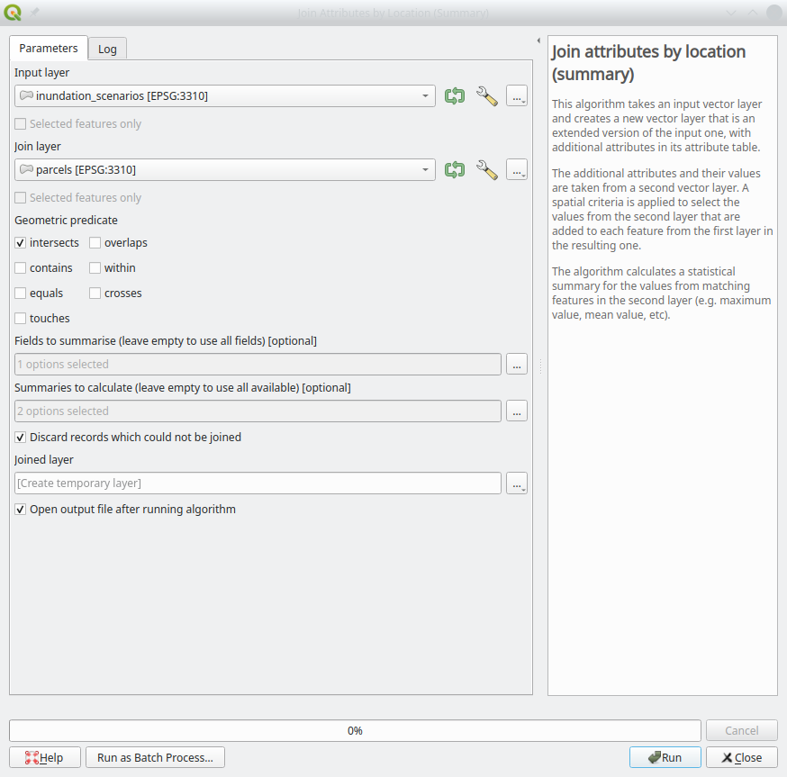
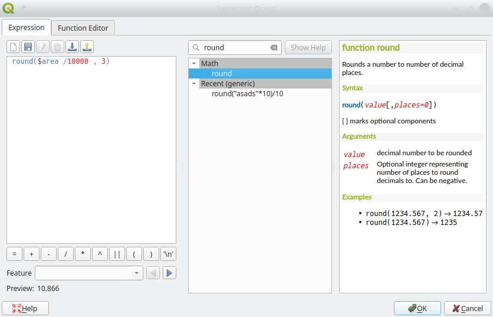

## Assignment 2 - Sea level rise in Santa Barbara

Due at **Fri 2023-02-10 23:59**

**CONTENTS**

- TOC
{:toc}
### Introduction

#### Tasks

1. Work through tutorials.
2. Perform a geospatial analysis using QGIS, and produce results data.
3. Design a map to communicate your results.
4. Submit your work to course website.

#### Grading

This assignment is worth **20 points**: 10 points for your map and 10 points for your data, awarded according to the [evaluation rubric](rubric.md). Your map must present your results accurately and clearly, and adhere to cartographic design principles. Your data must use correct units, data types, and file format.

#### Problem

In this homework, we'll analyze some potential impacts of sea-level rise in the city of Santa Barbara, ranging from likely (~0.5 m) to catastrophic (~4 m; e.g., a continental ice sheet collapse). To reduce computational requirements, we've restricted our region of interest (ROI) to the downtown Santa Barbara area.

Your assignment is to estimate the **cumulative** impact of nine scenarios of sea level rise: 0 m, 0.5 m, 1.0 m, ... , 4 m increases in mean sea level. You will compute three metrics for each sea level rise scenario, as shown in Table 1.

| S<br>sea level rise<br>(meters) | A<br>area flooded<br>(hectares) | P<br>parcels<br>count | L<br>flooded property losses<br>($millions) |
|:-: |:-:|:-:|:-:|
| 0  | ? | ? | ? |
| 0.5 | ? | ? | ? |
| 1.0 | ? | ? | ? |
| 1.5 | ? | ? | ? |
| 2.0 | ? | ? | ? |
| 2.5 | ? | ? | ? |
| 3.0 | ? | ? | ? |
| 3.5 | ? | ? | ? |
| 4.0 | ? | ? | ? |

**<center>Table 1: Results template</center>**

Again, the values of A, P, and L are **cumulative**: they apply to all areas affected by a corresponding amount of sea level rise (e.g., the values for a sea level rise of *n* meters should represent the **total** impact of a sea level rise from 0 to n meters.)

> NOTE: The 0 m scenario will still show a few low-lying properties as flooded, so you must include it in your analysis.

#### Available data

The data you need are in `HW2.gpkg` (in [`HW2.zip`](HW2.zip)). The following layers are provided:

- *ROI*: a rectangle defining the region-of-interest (ROI) for your analysis
- *SLR_scenarios*: polygonal features covering the areas inundated by each **incremental** sea level rise scenario
  - i.e., an *SLR_m* value of *n* means the feature covers the area inundated by a sea level rise from *n* to 0.5 + *n* meters.
  - The inundation features were generated from a high-resolution digital elevation model extracted from the [NOAA's 2009 - 2011 CA Coastal Conservancy Coastal Lidar Project](https://www.fisheries.noaa.gov/inport/item/48166) dataset.
  - Only features selected by the ROI have been retained.
- *parcels*: Santa Barbara county assessor's parcels
  - These polygonal features were extracted from the  07 March 2010 version of *Tax Assessment Parcels (without Owner Names or Sales Data)*, obtained from the Santa Barbara County Enterprise Geographic Information System. Metadata was provided by Zacharias Hunt, Santa Barbara County Geographic Information Officer.
    - These data are no longer available online ☹️
  - The attributes of these features are described in `ParcelMetadata.pdf` (in [`HW2.zip`](HW2.zip)).
  - Only features selected by the ROI have been retained.
- *SB_city*, *SB_county*, *California*: Layers containing outlines of the city and county of Santa Barbara and the state of California.
  - These layers aren't necessary for your analysis, but may be useful in constructing your final map.

All data are in the *NAD 83 / California Alber*s projection (EPSG:3310).

### Task 1 (optional): Tutorials

Work through [Lab 8: Spatial Selection](Bolstad_L8.zip) of the Bolstad book.

> NOTE: The Lab 8 instructs you to edit a table stored in a `.csv` file. Don't do this—[editing `.csv` tables in QGIS is buggy](../../general/CSVs_Windows/index.md). Instead, export the table into a geopackage, remove the `.csv` from your map, then add and edit the geopackage version.

### Task 2: Geospatial analysis and results data

#### Setup

Download [`HW2.zip`](data_qgis/HW2.zip) and extract the contents into your `ESM263` folder.

Create a new map in *QGIS* called `HW2.qgz` and add all the layers *ROI*, *parcels*, and *SLR_scenarios*.

Read the metadata in `ParcelMetadata.pdf`. There are several property value attributes. We will use `NET_AV`: the net assessed value (in USD) for the parcel.

#### Spatial join

You'll perform a **spatial join** of the *parcels* and the *SLR_scenarios* layers. Use the *Join attributes by location (summary)* tool.

> **NOTE:** There is also a **Join attributes by location** tool. Make sure to use the one whose name ends with "**(summary)**"

- Set *Input layer* to *SLR_scenarios*.
- Set *join layer* to *parcels*.
- For *Geometric predicate*, check *intersects* (the default).
- Set *Fields to summarise* to *NET_AV*.
- Set *Summaries to calculate* to *sum* and *count*.
- Check *Discard records which could not be joined*.

> A tip to help you select the correct input and join layers: The <u>input</u> layer is the one that will be modified with new attributes in the spatial join. Since we want the sum of the parcel values and the count of the parcels to be added to the inundation scenarios, it will be the input layer.



**<center>Figure 3: Spatial Join</center>**

Rename the newly created (temporary) layer to *results* and save it into a new geopackage.

#### Calculate flooded area

If you did everything correctly, the *results* layer's attribute table contains the correct values of the count of the inundated parcels and their total assessed value. However, you're missing the flooded area. Use the field calculator to create a new field *flooded_area* (don't just call it *area*; that will cause errors when you try to save the layer to a geopackage.)

- Coordinates in the California Albers projection are in meters; thus, calculated areas will be in units of square meters, which you need to convert to hectares.
- Use the *round()* function to round your the calculated area a reasonable number of significant digits.



**<center>Figure 4: Use field calculator to calculate the area</center>**

#### Calculate cumulative values

You now have the following attributes for each 0.5 **increment** of sea level rise represented by the features in *SLR_scenarios*:

- *NET_AV_count*: number of parcels flooded
- *NET_AV_sum*: value of those flooded parcels ($ USD)
- *flooded_area*: area flooded (hectares)

However, you will [recall](#problem) that what you really want are **cumulative** values—e.g., to get the total number of parcels flooded by *n* meters of sea level rise, you'll need to sum up the number of parcels flooded by all sea level rise increment less than or equal to *n*.

Sounds like a job for Excel, right? Well, it turns out that it's not too difficult (if [not exactly obvious](https://gis.stackexchange.com/questions/419463/cumulative-sum-in-qgis-attribute-table) how) to do this in QGIS. Just like we calculated the flooded area using a Field Calculator expression, we can use a slightly more complicated one to do the cumulative sums—here it is so you can copy-n-paste it:

```
with_variable(
    'SLR_m',
    SLR_m,
    sum(flooded_area, filter := SLR_m <= @SLR_m)
)
```

Change `flooded_area` to `NET_AV_count` or `NET_AV_sum` to calculate the cumulative values for those columns. (Remember to convert *NET_AV_sum* to $millions).

Name the new columns *A*, *P*, and *L* (of course…).

### Task 3: Map results

Design a map that communicates your results, including a table with the relevant fields of the attribute table of your results layer. Consider these questions:

- What are the data source(s) and units for your results?
- Which information from your results do you want to communicate?
- What is an appropriate symbology to communicate your results visually?
- How will you layout and organize your map elements?
- How will you describe your results in these map elements?
- How will you design your base layers to provide appropriate context for your results?

### Task 4: Turn in your work

1. Export your map as a PDF document to `HW2.pdf` using the same settings as in [Assignment 1](../01/index.md#task-3-design-a-map).
1. Export your *results* layer's attribute table to a CSV file named `HW2.csv`. Make sure that the CSV file only has the 4 fields *SLR_m*, *A*, *P*, and *L*.
1. Rename your files to include your full name, and use correct capitalization with no spaces or punctuation; e.g., `HW2MortimerSnerd`, **NOT** `HW2-mortimer-snerd` or `hw2mortimersnerd`:
   - `HW2.pdf` to `HW2FirstLastName.pdf`
   - `HW2.csv` to `HW2FirstLastName.csv`
1. Verify that your PDF document displays correctly, and that your CSV file is readable by QGIS (and/or Excel) and has the correct field names and data types.
1. Upload your PDF and CSV files to the Assignment 2 link on Canvas.
