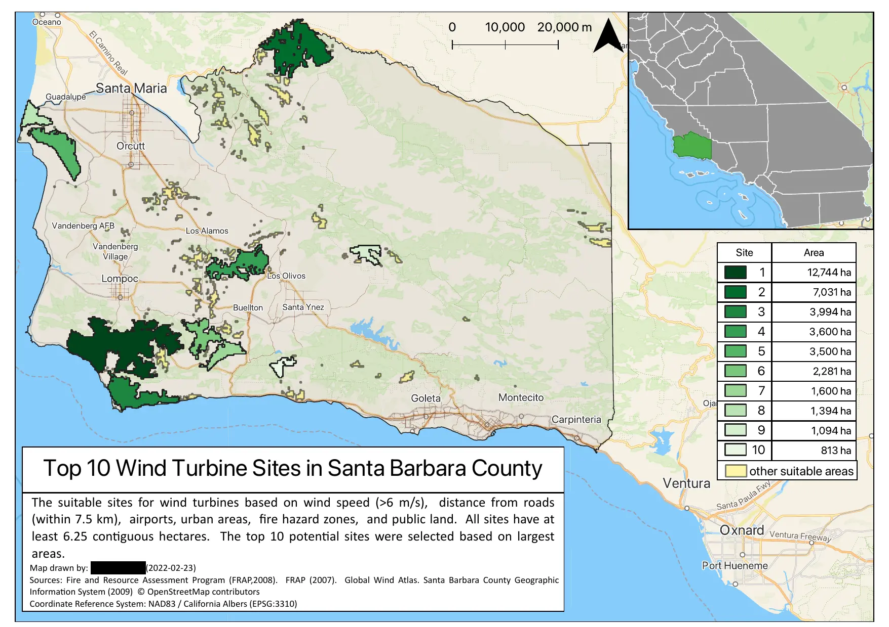

# Assignment 3 - Feedback


**CONTENTS**
- TOC
{:toc}

 
# Gottchas

## (Almost) all models ran!
Verify; exchange with a partner

## Be neat

### Use layer groups


### Remove your temporary layers


### Chaos in model
- Try to reduce chaos in the model
- Cleanup your project models
- use snapping

#### Chaos


#### Neat 1


#### Neat 2


### Don't make me guess which model to use


## Reclassify (wind)
Set the upper boundaries to "infinity" (e.g. an unrealistically high value) or keep it empty.


## Top 10
I know I encourage brevity in the text, but you cannot say "top 10 sites" without specifying what makes them top 10.
How about you just call them "largest 10 sites"?
 


## Dependency
Setting a dependency will merely tell Q that it is supposed to wait for another tool to finish. It does not set the inputs.


## Model outputs
In real life, you likely only want to have the final result as an output. None of the intermediate masks.
For me to help debugging. Keep them in though.

## Model output vs Map
If your model produces other results than what you show in the map, I may suspect maliciousness.
This is an incredibly slippery slope. Never ever present results that differ from the output of your computation. 

## Calculate rank by area


## Merge layers
Wrong:


Correct:


## Invalid geometries
You may receive:

```
Feature (8) from “Calculated” has invalid geometry. 
Please fix the geometry or change the “Invalid features filtering” 
option for this input or globally in Processing settings.
Error encountered while running 
```
The reason for this is that vectorize can produce invalid geometries. Use the "fix geometries" algorithm.


[What are invalid geometries?](https://community.safe.com/s/article/invalid-ogc-geometry-examples)

[Tutorial to handle invalid geometries](https://www.qgistutorials.com/en/docs/3/handling_invalid_geometries.html)


## FID as ID
FIDs are idiosyncratic to your project file. They are not be an ideal identifier on a map.


## Save model in project file


## Symbol for year
Use 'a' rather than 'yr' [[IAU (International Astronomical Union)](https://www.iau.org/publications/proceedings_rules/units/)]

## Setting CRS
Be careful when setting CRS to project CRS. You never know in what context your model might be opened.
Better:
- Hardcode it
- Leave it as the default (it will use the input CRS)
- Set it as a model parameter

## Extract by attribute
Careful with extract by attribute. It has TWO ouputs!!


## Rename algorithms
When you have the same algorithm more than once in a model, make sure to rename it so you can identify it.


## Locator
[HW2 feedback](https://jamesfrew.github.io/ESM_263_GIS/assignment/02/feedback/#locator-map)


# Nice Maps

## 1


## 2


## 3 


## 4


## 5


## 6


## 7


## 8


## 9


## 10

