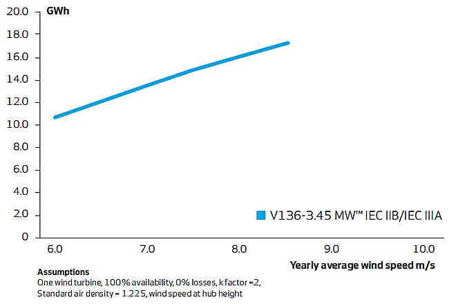
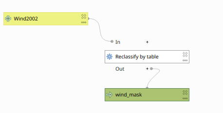
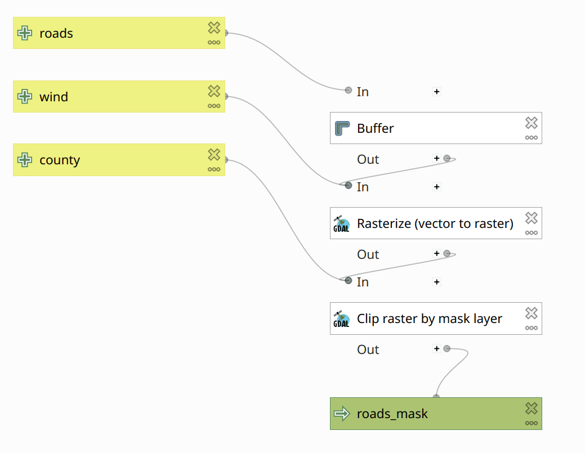
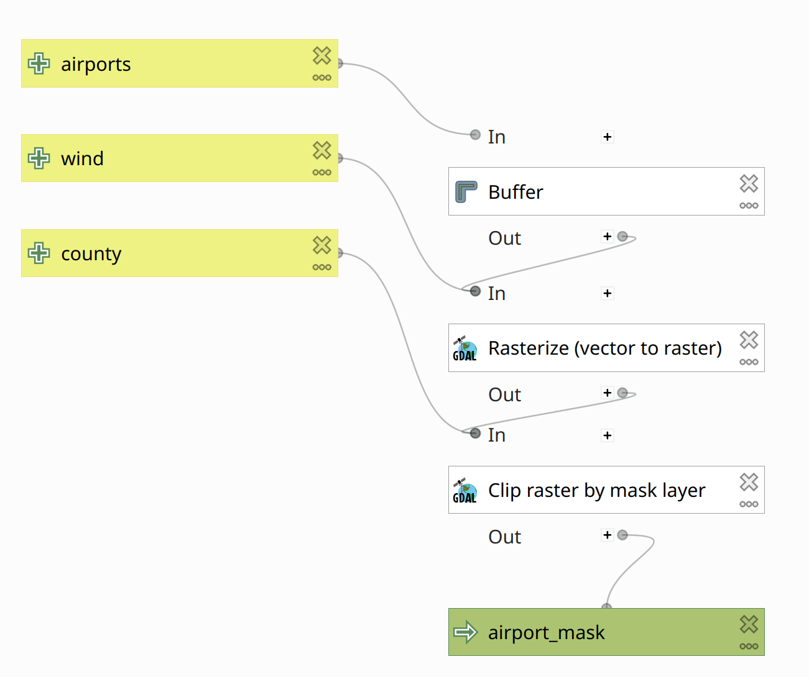
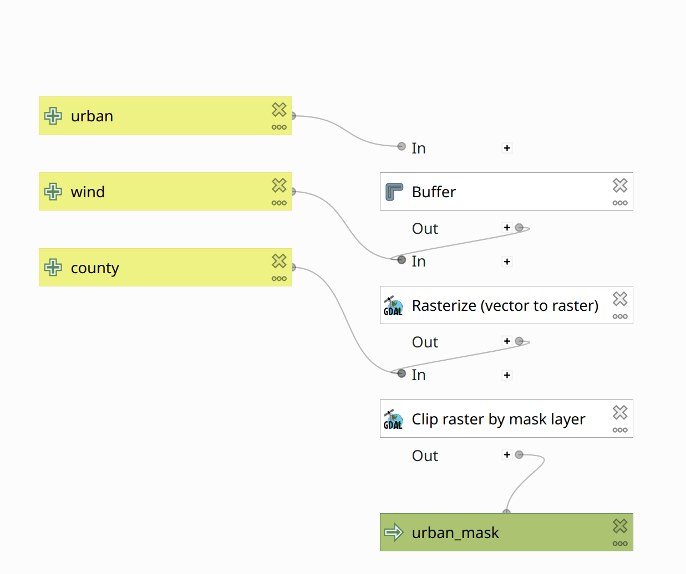
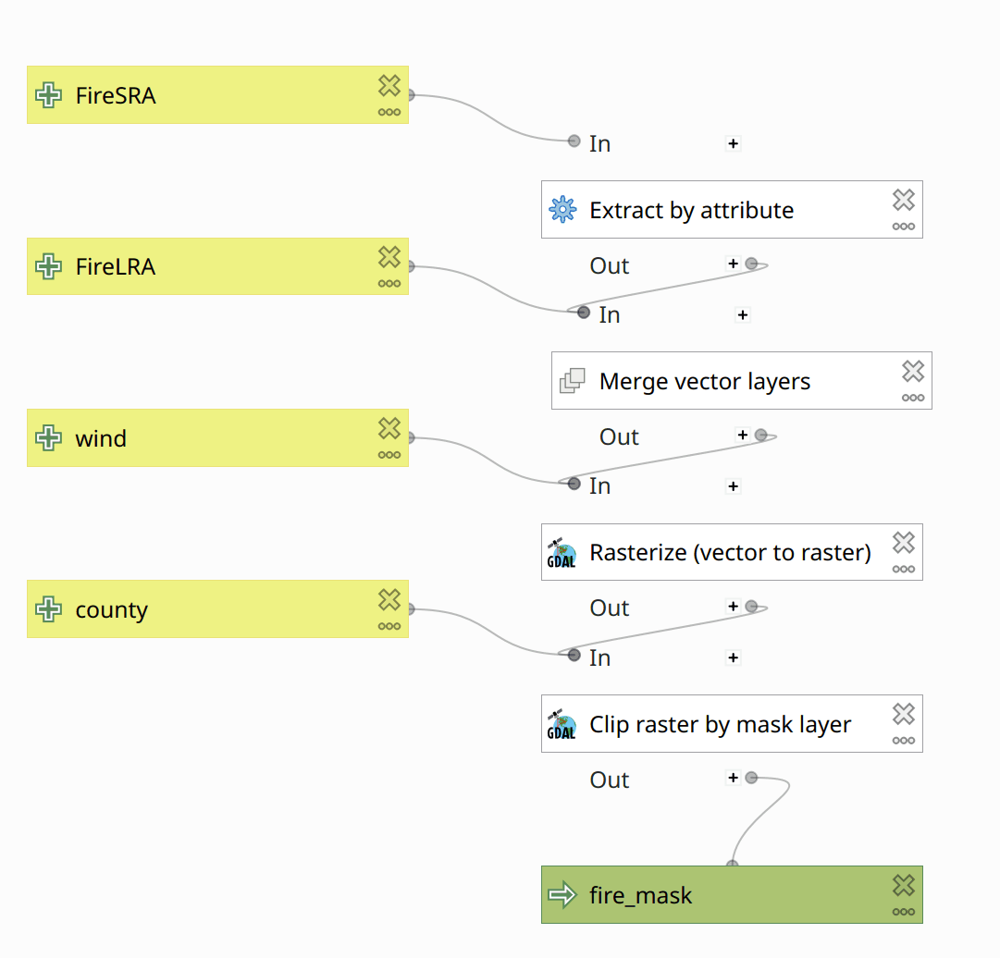
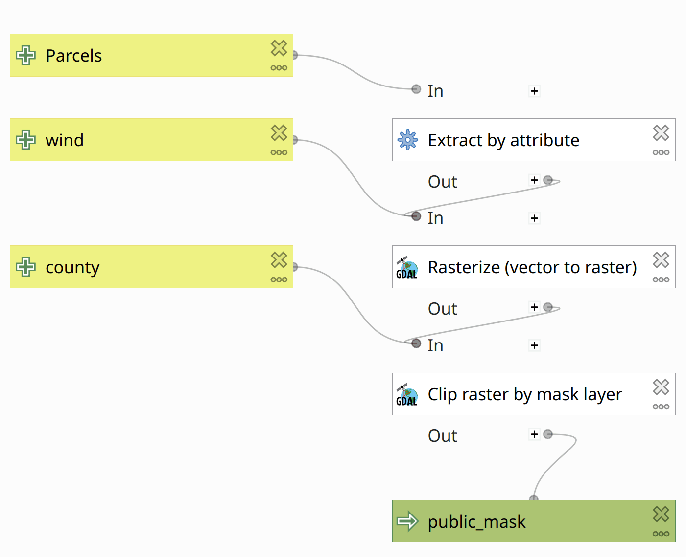
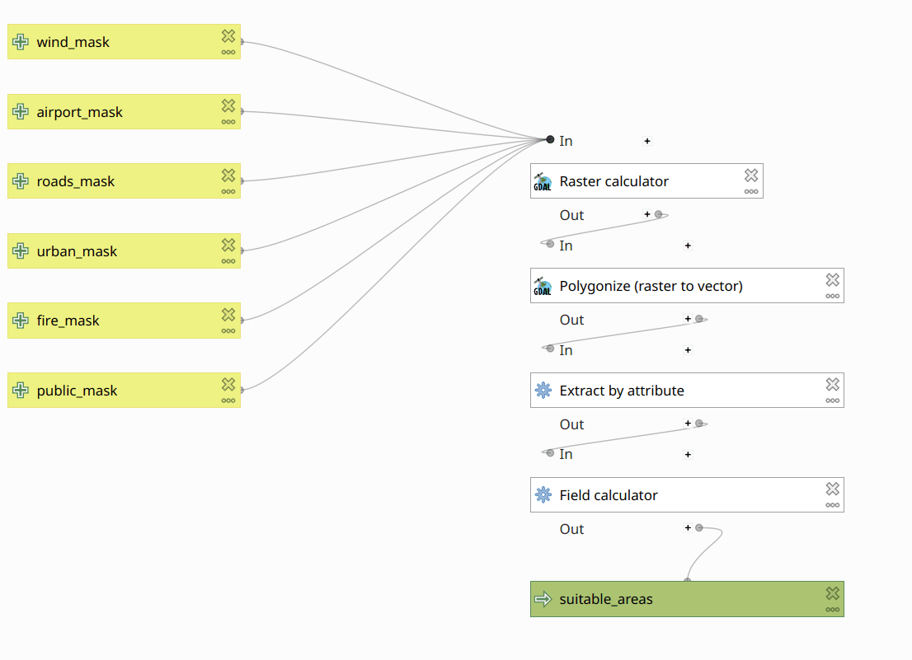

## Assignment 3 - Site suitability analysis for wind power subsidies

Due **Wed 2022-02-23 23:59** (Note new date!)

> NOTE: This is a complicated assignment! (The next one will be even more so.) Read it through, carefully, all the way to the end, before you start working on it!

> NOTE 2: An error in the [Result](#result) section (specifically, in the description of the *Polygonize* and *Extract by attribute* tools) has been fixed—please re-read it carefully!

**CONTENTS**
- TOC
{:toc}
### Tasks

1. Create a graphical model that implements a suitability analysis.
1. Design a map to communicate your results.
1. Submit your work to gauchospace.

### Grading

This assignment is worth **30 points**—10 points each for your

- map
- model
- data

awarded according to the [evaluation rubric](rubric.md).

### Problem

The Energy Division from the Department of Planning & Development of Santa Barbara County seeks your advice on wind energy. They have received a grant to seed wind energy production by subsidizing [Vestas V136-3.45 MW](https://us.vestas.com/en-us/products/4-mw-platform/V136-3-45-MW) turbines for installation within mainland Santa Barbara County. These turbines operate at hub heights of 150 m.

Considering the turbine's Capital expenditure (CAPEX), Operating expense (OPEX), lifetime, and feed-in tariff, a V136 will not be economically viable if operated at locations with average annual wind speeds of less than 6 m/s at hub height. 

The Energy Division wants a ranked list of 10 potential sites, each with at least 6.25 contiguous hectares, that meet their suitability requirements, written as follows:

- **Wind**: Sites must have sufficient wind power density.
- **Roads**: Sites must be within 7.5 km of a major road.
- **Airports**: Sites cannot be within 7.5 km of an airport.
- **Urban**: Sites cannot be within 1 mile of an existing urban area.
- **Fire**: Sites cannot be within fire hazard zones
- **Public**: Sites cannot be on public land

### Bonus Objective

Using the wind speed dataset and the wind turbine specifications (power curve), calculate the estimate annual wind power production potential for each site.

To calculate the placement density (i.e. how many turbines can be placed in a cell or in a site), assume a minimal distance of 5x the rotor diameter (136 m) between individual turbines i.e. max one turbine per (5 × 136 m)<sup>2</sup>=0.4624 km<sup>2</sup>. Considering a cell size of 0.0625 km<sup>2</sup>, we need about 7.4 cells per turbine. Fractional turbines per site are OK.

The annual wind production can be calculated as follows:

- ***E*** = 2.6 s m<sup>-1</sup> ***v***  +  -5 GWh
    - where
        - ***E*** = energy production per turbine in GWh
        - ***v*** = average annual wind speed in m s<sup>-1</sup>
    - This is derived from our specified turbine's power curve: 

 

### Available data

The data for this assignment are in [`HW3.zip`](HW3.zip)

The archive contains 3 files:

1. `HW3.gpkg`: a geopackage containing following layers:

   - **airports**: airport boundaries. OSM/Geofabrik [source](https://download.geofabrik.de/north-america/us/california/socal.html). Accessed 2022-02-03. [Description](https://download.geofabrik.de/osm-data-in-gis-formats-free.pdf). Subset of the transportation layer:

     ```
     WHERE fclass IN (
         'airfield',
         'airport',
         'apron',
         'helipad'
     )
     ```

   - **county**: mainland Santa Barbara county line. Source: SBCGIS, 2008.

   - **FireLRA**: recommended Fire Hazard Severity Zones in Local Responsibility Areas. We *already* filtered these data so that all features have `HAZ_CODE = 3`. Source: Fire and Resource Assessment Program ([FRAP](http://frap.fire.ca.gov/)), 2008.

   - **FireSRA**: adopted Fire Hazard Severity Zones in State Responsibility Areas. These data are *not* filtered; they include multiple zone types. Assume "fire hazard zones" are zones where `HAZ_CODE = 3`. Source: [FRAP](http://frap.fire.ca.gov/), 2007.

   - **parcels**: We've already filtered these data to contain only features where `NONTAXCODE = US` (federal) or `NONTAXCODE = ST` (state). Assume that "designated as parks or other public use" are parcels where `USECODE` starts with a 6, 7, or 8 (e.g., 6xxx, 7xxx, or 8xxx.) Source: SBCGIS, 2009.

   - **roads**: OSM/Geofabrik [source](https://download.geofabrik.de/north-america/us/california/socal.html). Accessed 2022-02-03. [Description](https://download.geofabrik.de/osm-data-in-gis-formats-free.pdf). Subset of the roads layer:

     ```
     WHERE fclass IN (
     	'motorway',
     	'motorway_link',
     	'primary',
     	'primary_link',
     	'secondary',
     	'secondary_link',
     	'tertiary',
     	'tertiary_link',
     	'trunk'
     )
     ```

   - **urban**: OSM/Geofabrik [source](https://download.geofabrik.de/north-america/us/california/socal.html). Accessed 2022-02-03. [Description](https://download.geofabrik.de/osm-data-in-gis-formats-free.pdf). Subset of the landuse layer:

     ```
     WHERE fclass IN (
         'allotments',
         'commercial',
         'industrial',
         'residential',
         'retail'
     )
     ```

   All data layers have been projected into the *NAD83 / California Albers* (EPSG:3310) CRS, and clipped  to the Santa Barbara County mainland.

2. `wind.tif`: average annual wind speed in m s<sup>-1</sup> at a height of 150 m. Global Wind Atlas. [Source](https://globalwindatlas.info/api/gis/country/USA/wind-speed/150). Accessed 2022-02-03 and clipped to mainland SB county.

3. `wind.tif.aux.xml`: metadata "sidecar" file for `wind.tif`

### Task 1: Suitability analysis

Use the Graphical Modeler to implement a binary model that produces a *suitability raster*, where each cell indicates whether that area satisfies *all* the provided constraints.

- Remember to check the [QGIS Graphical Modeler FAQs](../../general/graphical_modeler_faq.md).

Figures 1-6 show the specific QGIS tools and data flow necessary at each step to implement your model. These figures are separate for clarity purposes only. **You will implement all these steps together in a single model** ([example](images/full_model.png)).

#### Wind



Use the [*Reclassify by table*](https://docs.qgis.org/3.16/en/docs/user_manual/processing_algs/qgis/rasteranalysis.html#reclassify-by-layer) tool to produce a raster layer which has cell values of 1 if the windspeed is at or above our threshold.

- Edit the *Reclassification table* to set the appropriate input range to map to `1`.
- In *Advanced Parameters*:
  - Leave *Output no data value* as `-9999`
  - Make sure *Range boundaries* is appropriate for the values you entered in the reclassification table.
  - Check *Use no data when no range matches value*

#### Roads



Remember to dissolve the buffers!

The *Rasterize* tool has a bunch of (ahem) somewhat less-than-intuitive settings&mdash;consult the [QGIS manual](https://docs.qgis.org/3.16/en/docs/user_manual/processing_algs/gdal/vectorconversion.html?highlight=rasterize#rasterize-vector-to-raster). In particular:

- Set *A fixed value to burn [optional]* to `1`.
- Set *Output raster size units* to *Georeferenced units*.
- Set **both** *Width/Horizontal resolution* and *Width/Vertical resolution* to `250`.
- Set *Output extent* to *Model input*, and select *Wind2002* (or whatever you called the wind raster in yout model.)
- Set *Assign a specified nodata value to output bands [optional]* to `-9999` (for consistency with *Reclassify by table*).

These settings ensure that your mask rasters will line up each other, and with the *Wind2002* raster layer.

Use the [Clip Raster by mask layer](https://docs.qgis.org/3.16/en/docs/user_manual/processing_algs/gdal/rasterextraction.html#clip-raster-by-mask-layer) to crop the mask to the shape of the Santa Barbara county.

- **Un-**check *Match the extent of the clipped raster to the extent of the mask layer*

#### Airports



Use the *Buffer*, *Rasterize*, and *Clip raster by mask layer* tools like you did for the roads.

For the *Airports*, *Urban*, *Fire*, and *Public* layers, the buffers indicate **exclusion** zones; i.e. areas that do **not** fulfil the criteria for wind turbine siting. Therefore, in *Rasterize (vector to raster)*, expand *Advanced Parameters*, and check *Invert rasterization*. This will write the no data value to cells that intersect the buffer, and `1` everywhere else.

#### Urban



#### Fire



#### Public



<!-- Use extract by expression -->

#### Result



Use the GDAL *Raster calculator* tool to sum up the masks and classify suitable areas. (A cell that has the value 1 in **all** of the masks is a suitable area/cell).

Note that there is also a QGIS native raster calculator, which seems to struggle with the temporary layers in the model. Therefore, use the GDAL raster calculator. The settings will look something like [this](images/raster_calc.png).

Convert the raster layer to a vector layer. Set the name of the field to create to something meaningful, such as "sum_of_masks". Select only the polygons that have a "sum_of_masks" value of **6**. Finally, use the field calculator to create an additional field to hold the area of the features.

#### General advice

When working in Graphical Modeler, you should build your model using an iterative process; i.e., **one tool at a time**. The tools you can find in the Graphical Modeler are identical to the tools you find in your main QGIS window. You can therefore \"manually\" experiment with them before in the QGIS main window.

1. Define the Parameters of your model by adding (double click or drag) the according Parameters from the *Inputs* tab of the Graphical Modeler.
1. Assign meaningful names to the parameters (note: The names you assign here are only used within the model.)
1. Find the tool you need in the *Algorithms* tab of the Graphical Modeler.
1. Double click or drag the tool into your model to add it.
1. Give the tool a meaningful name/description.
1. Define the tool's input.
1. Configure the tool.
1. If the tool\'s output is the final result, rename the tool\'s output data as appropriate. The name you specify here will be the name of the layer that will be added to QGIS after the model is successfully executed.
1. Run the Model.
1. Did it work as expected?
1. Repeat until all steps are in your model.
1. Save your model often (into the project). Consult the [Graphical Modeler FAQ](../../general/graphical_modeler_faq.md).

### Task 2: Map results

Design a map that communicates your results, and clearly identifies your 10 most suitable sites.

### Task 3: Turn in your work

You will upload **three files**: your map, your project (which contains your model), and your results data.

#### Map

Export your map as a PDF document and name it `HW3FirstnameLastname.pdf`.

- If you have problems with transparency in your PDF, you may export your map to a PNG image instead—name it `HW3FirstnameLastname.png`

#### Model

Organize and name your processes and data to *clearly* describe your model.

(Re)Name your model `HW3` and save it in your QGIS project.

(Re)Name your project `HW3FirstnameLastname.qgz`

A good way to check that your model is "run-ready" is to let a classmate try to run a copy of it in their own account.

#### Results Data

Export your suitability areas layer into a geopackage (right click your results layer *Export -> Save Features As...* ). Name the geopackage `HW3FirstnameLastname.gpkg`, and the layer `results`.

Make sure the `results` layer contains only the relevant fields.

You can optionally add a second layer to the same geopackage containing the top 10 sites (name it `top10`).

####  Upload your three files to GauchoSpace

1. map: `HW3FirstnameLastname.pdf` (or `HW3FirstnameLastname.png`)
1. model: in `HW3FirstnameLastname.qgz`
1. date: `HW3FirstnameLastname.gpkg`

