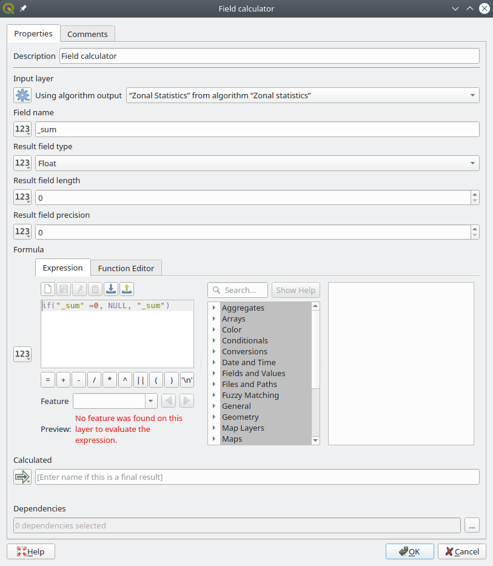

## Assignment 4 notes

**CONTENTS**

- TOC
{:toc}

### Creating a mask 

When using the Reclassify tool to create a **mask**, a nice shortcut is to just specify reclassifications for the input values you want to be 1, and force **all** other input values to map to *no data*. You can do that by opening the advanced parameters and set *Use no data when no range matches value*

### Clip raster by mask layer

The Landsat and DEM layers are larger than our ROI. To speed up compuation, our first step should be clipping them to the ROI. Remember to set the nodata value to something negative and leave all other parameters unchanged.

### Zonal Statistics and *no data*

When calculating zonal statistics, the "sum" will be 0 if only *no data* values had been found intersecting a feature. This is technically incorrect, and is a problem since watersheds that are fully on public land will appear to be very cheap instead of disqualified.  We therefore need to make sure to replace all "sum" = 0 with *no data*; e.g. with an additional *Field calculator* step

### Polygon to Raster

Whenever you use the *Rasterize* tool in Assignment 4, set 

- *Output raster size units* to *Georeferenced Units* 
- *Width/Horizontal resolution* to `100`
- *Height/Vertical resolution* to `100`
- *Output extent* to the ROI layer
- The specified nodata value to `-9999`
