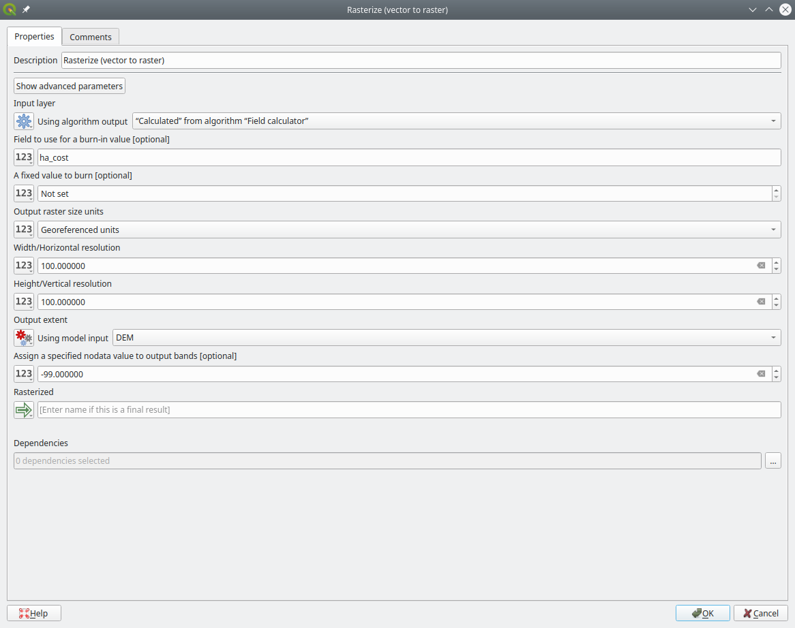
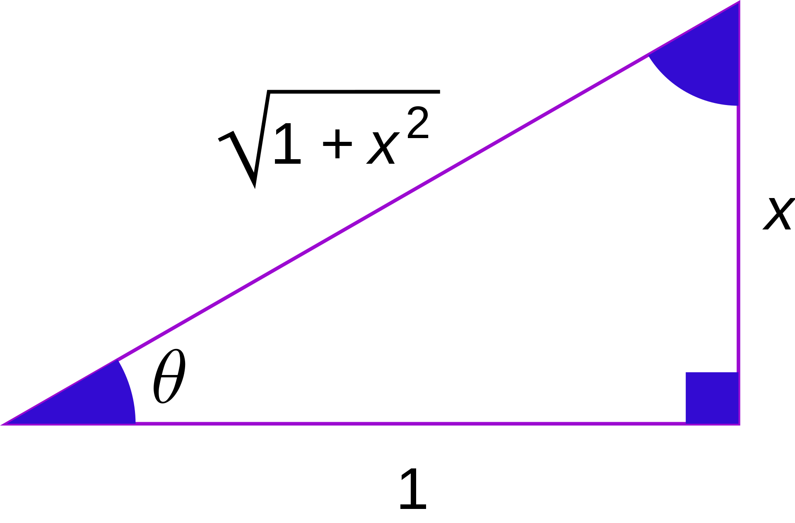

 
**CONTENTS**

- TOC
{:toc}

## Project
### Unavailable layers
Remember not to reference any layers that you are not shipping. E.g. if you saved some of your layers that are in a geopackage that you don't deliver. ... for this assignment we of course did not allow you to upload your geopackage. But keep this in mind for the future.

### Broken Geometries
Polygonize might sometimes cause broken geometries to be created (self intersection). Don't panic. Just add a fix geometries algorithm.

## Map

### Numbers
If you right justify numbers (which you always should), add trailing decimal zeros so that the decimal separator lines up

### Highlight whats important
Highlight the 1-5 top watersheds

### Labels
Labels are generally a good idea, but make sure it is obvious what the labels mean. Why not use the CALWNUM?

## Model

### Drop zero counts
To get rid of watersheds that have no cost information, use a field calculator with an expression of

    IF(cost_count<1, NULL, cost_sum)

### Rasterize
Two common mistakes:
- Make sure you set Georeference units vs Pixel in rasterize!
- Take care, to leave the burn in value empty if you want to assign a field value you burn in 0 in your rasterize step in the develop model. Keep that field empty

### NoData
Don't ever use 0 as a NoData value

### Joins
When you do the joins in the end, remember that you don't have to copy ALL the fields, just the respective scores

### Raster calculator
Q's raster calculator is an asshole. It does not wait for its inputs. 
Therefore some of you could run the riparian model alone, but not in the supermodel. 
Replace the raster calculator with the GDAL raster calculator. 

### Polygonize
Watch out with the polygonize step. There are two tools that do seemingly the same thing. Gdal's polygonize vs "raster pixels to polygons". The later will draw a polygon for each one of the pixels. This is NOT what we want. We want to use the gdal's polygonize tool. 
Spot the difference:

#### raster pixels to polygons

#### Polygonize

## Slope
Thanks to one of you guys, I caught this one before it was too late:
Q's slope algorithm calculates the sloe in degrees, not in percent! I.e. you want to reclassify your slopes up to arctan(0.2)

https://docs.qgis.org/testing/en/docs/user_manual/processing_algs/qgis/rasterterrainanalysis.html#qgisslope

## Bomb Diggity

### 1

### 2

### 3

### 4

### 5

### 6

### 7

