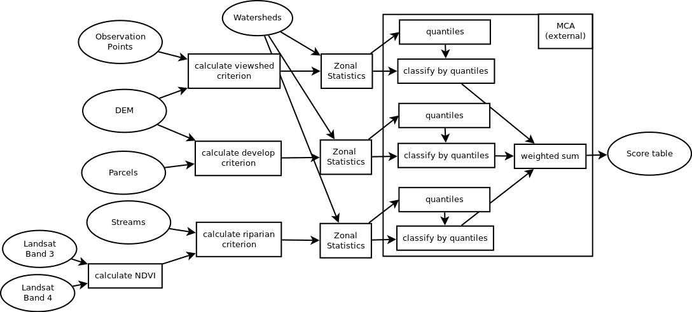
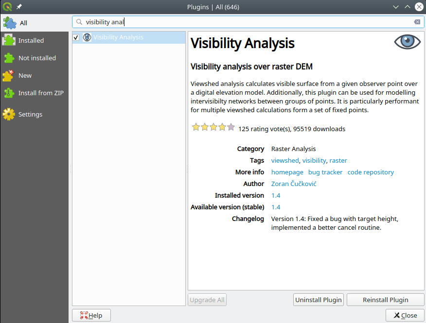

## Assignment 4: Multicriteria analysis for conservation priorities

Due **Fri 2023-03-24 23:59**

> **NOTE: This is a REALLY complicated assignment! Read it through, CAREFULLY, all the way to the end, before you start working on it!**

We've added some [Assignment 4 notes](HW4_notes.md). This document might grow over the course of the next 3 weeks.


**CONTENTS**

- TOC
{:toc}

### Tasks

1. Implement a multicriteria analysis (MCA), and produce a model and results data.
3. Design a map to communicate your results.
4. Submit your work to course website.

### Grading

This assignment is worth **40 points** - 10 points each for your map and data, and 20 points for your model.

### Problem

Once upon a time, a Bren School group project ([Boland *et al* 2005](https://bren.ucsb.edu/projects/classifying-sites-ventura-hillsides-acquisition-ventura-hillsides-conservancy)) developed a **multicriteria analysis** (MCA) framework to evaluate the conservation potential of land in Ventura County based on viewshed, habitat, and public access criteria. In this assignment, we will use a simplified version of their approach to evaluate the conservation potential of lands in southern Santa Barbara County.

Your task is to advise a land trust on which watersheds have the best overall conservation potential. The land trust wants to conduct conservation efforts in watersheds that would help **preserve both riparian habitat and scenic viewsheds through conservation easement purchases on inexpensive, but developable land.** You will use an MCA framework to produce your results.

### Available data

The data for this assignment are in [HW4.zip](HW4.zip).

They have all been projected into "NAD83 / California Albers" (EPSG:3310). The vector layers have been clipped to our region of interest (`roi`), which is a collection of watersheds in southern Santa Barbara County.

| layer                | source                                                       | notes                                                        |
| -------------------- | ------------------------------------------------------------ | ------------------------------------------------------------ |
| `dem100.tif`         | [USGS, 2009](http://nationalmap.gov/elevation.html)          | 1 arc second (30 m) National Elevation Dataset, resampled to 100 m |
| `landsat71.tif`      | [USGS, 2005](https://lta.cr.usgs.gov/LETMP)                  | Landsat ETM+, bands 1–5                                      |
| `parcels`            | SBCGIS, 2009                                                 | Santa Barbara County assessor's parcels                      |
| `Observation_Points` | (ESM 263)                                                    | we made these up                                             |
| `roi`                | (ESM 263)                                                    | dissolved `watersheds`                                       |
| `streams`            | SBCGIS, 2002                                                 | Southern Santa Barbara County streams                        |
| `watersheds`         | [Calwater 2.2.1](https://www.calfish.org/programsdata/referencelayershydrography/californiainteragencywatershedmapof1999.aspx) | Southern Santa Barbara County watersheds                     |

### Assumptions

-   **Riparian habitat** is anywhere within 1000 ft of a stream that has an observed [Normalized Difference Vegetation Index (NDVI)](../../week/06/Landsat_and_NDVI.md) between 0.2 and 0.5.

-   **Viewshed** is anywhere visible from at least one observation point.

-   **Developable land** is anywhere with a slope of less than 20 percent.

-   **Land cost** is the parcel price per square meter (USD / m²), calculated as `Parcels.NET_AV` (in USD) divided by `Parcels.Shape_Area` (in m²).

-   **Public parcels** (parcels with a non-null `Parcels.NONTAXCODE`) should be ignored.

-   **Unit of analysis** is 1 hectare (e.g., cell size = 100 m).

-   **Standardized scores** are integers from 1 to 4, where 1 = \"best\" and 4 = \"worst\".

    -   Use **quartiles** (4 quantiles) to assign the scores.
    -   Use the following weights to combine the scores:

        | weight | score                 |
        | -----: | --------------------- |
        |   0.50 | riparian habitat area |
        |   0.33 | viewshed area         |
        |   0.17 | developable land cost |

### Task 1: Implement MCA

Use a raster-based index model, or \"scoring\" approach to perform an MCA that will prioritize watersheds based on your client\'s criteria.

All MCAs follow four basic steps:

1. identify criteria
2. standardize factors (i.e. each watershed will be given a score of 1–4 for each of the criteria)
3. assign weights
4. combine

Your task is to develop an MCA model that will implement each of these steps (Figure 1).



**Figure 1**: A conceptual model for the complete analysis. Your task is to replace each of these notional tools with the actual QGIS geoprocessing workflow you develop for that step.

The output of your model will be a `Scores` table that has a score for each watershed.

#### Setup

Install (if you haven't already) the *Visibility Analysis* QGIS plugin. (Go to *Plugins→Manage and Install Plugins* and search for "Visibility Analysis"):



The analysis is done at a **resolution (cell size)** of 100 m x 100 m, and for the **extent** of our region of interest (`roi`).  Make sure that whenever you create a new raster, you set those values.

#### Recommended tools

Create 3 separate models for the three criteria.  Use those 3 models as algorithms in a "supermodel" where the criteria are combined.

When designing the geoprocessing workflow for each step of your analysis, we recommend using these tools.

1.  Riparian land constraint:
    1. *Buffer* (remember to dissolve)
    1. *Clip raster by mask layer* (Streams)
    1. *Clip raster by mask layer* (ROI)
    1. *Raster calculator* (remember [this issue](https://stackoverflow.com/questions/41908103/saturation-of-negative-values-in-gdal-calc-py-when-subtracting-l8-bands))
    1. *Reclassify by table*
    1. *Zonal statistics* (sum)
       - Note that there are two tools with the same name. One edits the input, the other produces an output. Use the second one.
    1. *Field calculator* (to categorize; see note below)
1.  Priority viewshed factor:
    1. *Clip raster by mask layer*
    1. *Create viewpoints*
       - observer height: **1.7 m**
       - radius: **10 km**
    1. *Viewshed* (default settings)
    1. *Reclassify by table*
    1. *Zonal statistics* (sum)
    1. *Field calculator* (to categorize; see note below)
1.  Developable land factor:
    1. Parcels
        1. *Extract by attribute*
        1. *Field Calculator*
        1. *Rasterize (vector to raster)*
    1. Slope
        1. *Clip raster by mask layer*
        1. *Slope*
        1. *Reclassify by table* to produce a mask.
        1. *Polygonize*
    1. Fix geometries
        1. *Clip raster by mask layer*
        1. *Zonal statistics* (sum)
        1. *Field calculator* (to categorize; see note below)
            - Note: You need to exclude watersheds that are completely located on public land; their land value `_sum` will be 0.
1.  Scoring the watersheds:
    1. *Join attributes by field value* (join on `calw221`) ... twice
    1. *Field calculator* for weighted sums

##### Regarding the categorization

The field calculator allows you to calculate the 1st and the 3rd quantile as well as the average across a field/column. With a bit of logic, you thus can classify each watershed:

```SQL
CASE
    WHEN "_sum" < q1("cost_sum") THEN 4
    WHEN "_sum" < median("cost_sum") THEN 3
    WHEN "_sum" < q3("cost_sum") THEN 2
    ELSE 1
END
```

Note that you need to consider the order ... expensive is bad.

<!-- We skip the interface building. Scores will be hard coded because of https://gis.stackexchange.com/questions/350142/connecting-number-parameter-to-field-calculator-in-qgis-modeler -->

### Task 2: Map

Design a map that communicates your results, and clearly identifies your prioritization of watersheds. Also, include a *brief* (50--100 words max) description of your analysis on your map.

### Task 3: Turn in your work

You will upload **three files**: your map, your project file, and your results data:

1. **Map**: Export your map as a PDF image and name it `HW4Lastname_map.pdf`
2. **Project file with model**: Organize and name your processes and data to *clearly* describe your models. Clearly name the models.
3. **Data**: Put your results from the `Scores` table into a CSV table with only two fields:

   | Name      | Type  | Description                                          |
   | --------- | ----- | ---------------------------------------------------- |
   | `calw221` | Text  | CalWater watershed identification code (Interagency) |
   | `score`   | Float | watershed score from your model, where 1 ≤ score ≤ 4 |

4. Upload your three files to Gauchospace
   - `HW4Lastname_map.pdf`
   - `HW4Lastname.qgz`
   - `HW4Lastname_data.csv`
