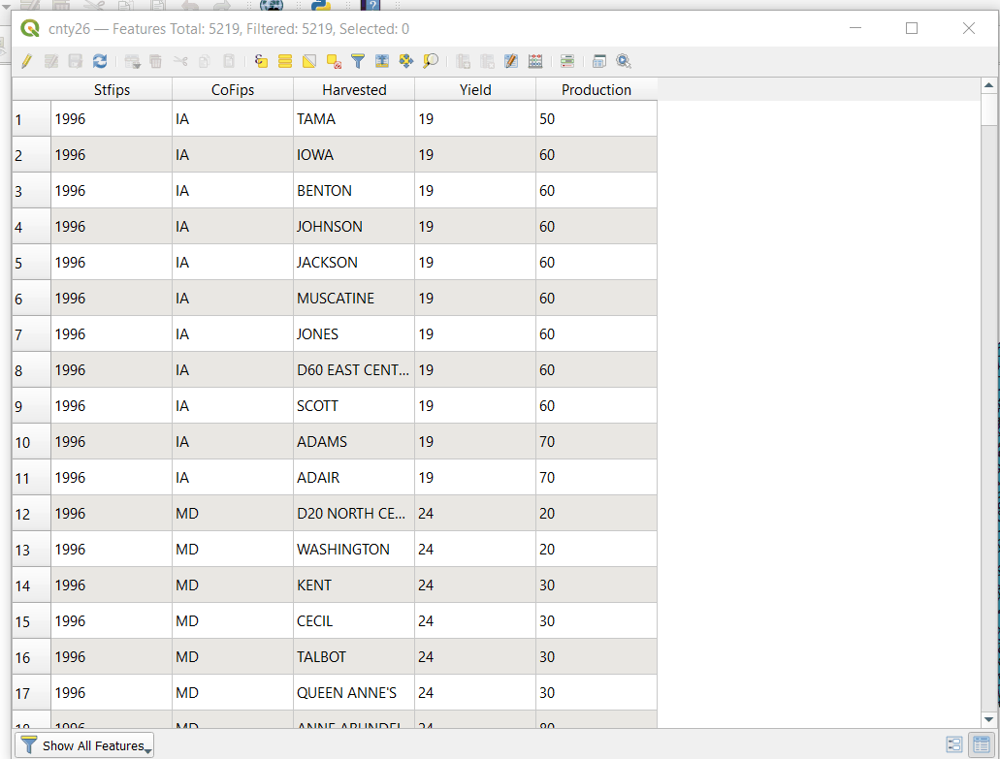

## Issues with CSVs in Windows

There is a bug in how QGIS handles CSV files on Windows (this isn't a problem on macOS or Linux.) This shows up in [Bolstad's Lab 8](../../week/04/Bolstad_L8/Bolstad_L8.pdf), where you delete the unwanted columns in `cnty26.csv`. However, on Windows, this removes the unwanted column **headers**, but keeps the wrong **data**. For instance, `year` data is now in the `STFIPS` column, and so on:

This has been [a problem for a while](https://gis.stackexchange.com/questions/107525/csv-handling-in-qgis). To work around it, **convert your CSV to a geopackage right after loading it**. Then, the geopackage and forget about the original CSV (i.e. remove it from your project).

