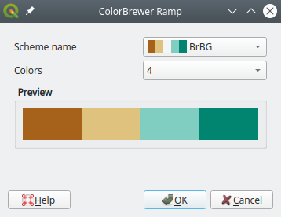
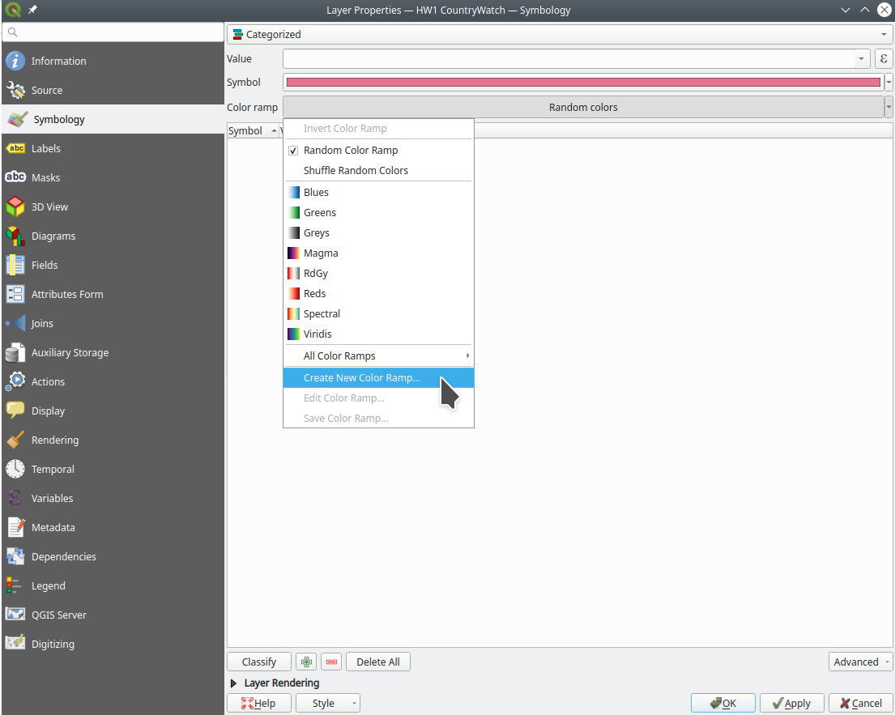

## ColorBrewer in QGIS

Colors in maps are tricky because aesthetics are obviously subjective. Even worse; distinguishing between two shades of green might be easy for some and impossible for others. 

To help you with decisions about color, there is a great online application called [ColorBrewer](https://colorbrewer2.org/). It lets you specify what kind of data you're trying to visualize, how how many classes you need to display, whether the colors should be "colorblind safe" (i.e., distinguishable by people with impaired color vision), and then presents you with a selection of color mappings.

Unfortunately you cannot automatically import the color ramps from this website (though you could [manually specify the colors](https://spatiallychallenged.com/2019/02/24/getting-category-colors-into-qgis-from-colorbrewer/)). Fortunately, QGIS has (somewhat clunky) built-in ColorBrewer color ramps.

# Create a new Color Brewer Color Ramp

- Go to *Settings→Style Manager…*

- Add a color ramp:
    1. Select the *Color Ramp* tab.
    1. Click on the little green plus at the bottom left corner of the window.
    1. Select *Catalog: Color Brewer...*

- Configure your new color ramp:
    1. Select a scheme.
    1. Select the number of dataset classes that you want to visualize.
    1. Click *OK*.

    
- Give the color ramp a name:

- Close the style manager.

Now if you go to the *Properties→Symbology* tab of the layer you want to visualize, you should find your newly added color ramp in the selection options for the color ramp.

# Alternative

You can also add a new ColorBrewer color ramp manually from a layer's *Properties→Symbology* tab:

# References

- [Color Ramp in QGIS](https://gis.stackexchange.com/questions/186322/color-ramp-in-qgis) (Stack Exchange)