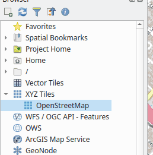
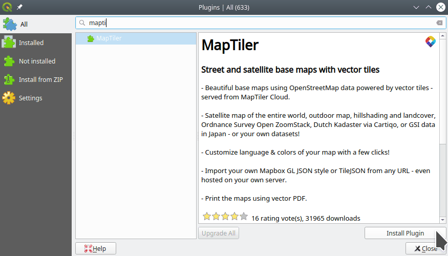
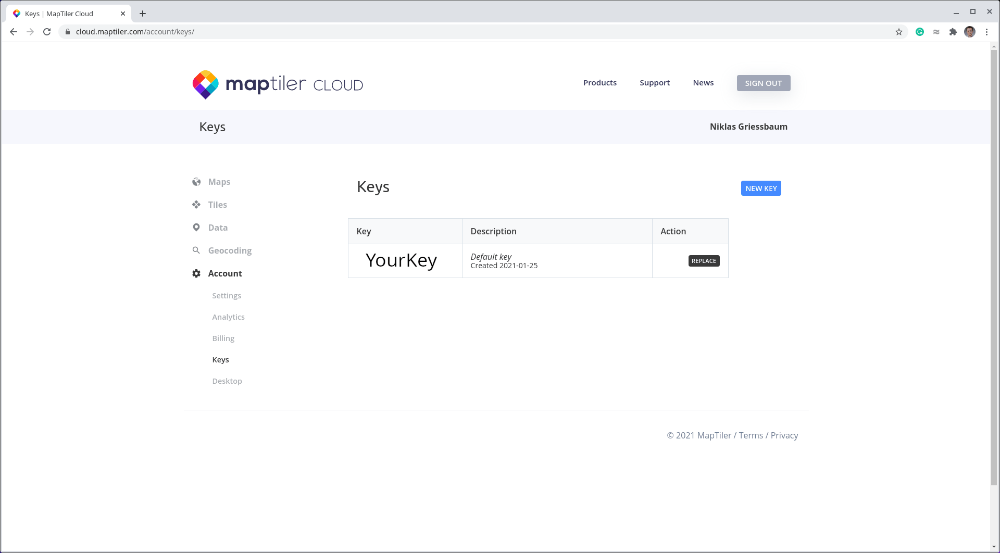

## Basemaps for QGIS

**CONTENTS**

- TOC
{:toc}
Having basemaps in the background of your maps is often helpful for orientation. A nice basemap may also make your map more visually appealing. Here are a few more sources of basemaps you can use in QGIS.

### XYZ Tiles

We've already encountered *OpenStreetMap*, which comes built-in to the QGIS Browser as an XYZ Tiles layer:

[This stackexchange post](https://gis.stackexchange.com/questions/20191/adding-basemaps-from-google-or-bing-in-qgis/217670#217670) ("No plugin required") is a handy guide to adding some popular web map services to QGIS as XYZ Tiles, so you can use them as basemaps.

### MapTiler

The company [MapTiler](https://www.maptiler.com/) provides a set of basemaps which can readily be used in QGIS. All you need to do is:

1. [Register](https://cloud.maptiler.com/auth/widget) with MapTiler

2. Install the QGIS *MapTiler* plugin 
    1. Go to *Plugins&rarr;Manage and Install Plugins*
    1. Search for *MapTiler*
    1. Click *Install Plugin*  
         
        You can now find MapTiler layers in your QGIS Browser panel. 

3. The first time you use it, the plugin will ask for your account key in a popup. Copy your personal key from the MapTiler website to your plugin.
    - On your MapTiler account, go to *Account&rarr;Keys*  
     
    - Copy the key and paste it into the QGIS *MapTiler* plugin popup.

### QuickMapServices

Another source of basemaps is the *QuickMapServices* plugin. You can install it at *Plugins&rarr;Manage and Install Plugins*. The plugin can then be accessed at *Web&rarr;QuickMapServices*.

You can get even more maps from *QuickMapServices* by adding the Contribute Pack. Go to *Web&rarr;QuickMapServices&rarr;Settings&rarr;More services* and click *Get contributed pack*. (Not all of these services work…)

### NASA GIBS (WMS)

- [Worldview](https://worldview.earthdata.nasa.gov/)
- [NASA GIBS](https://nasa-gibs.github.io/gibs-api-docs/gis-usage/#qgis)
