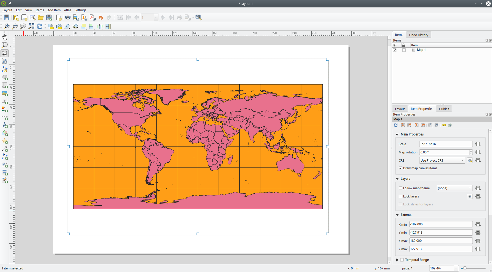
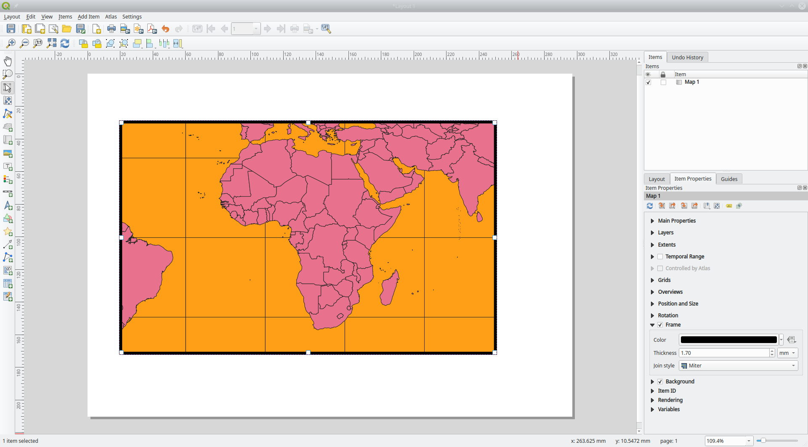
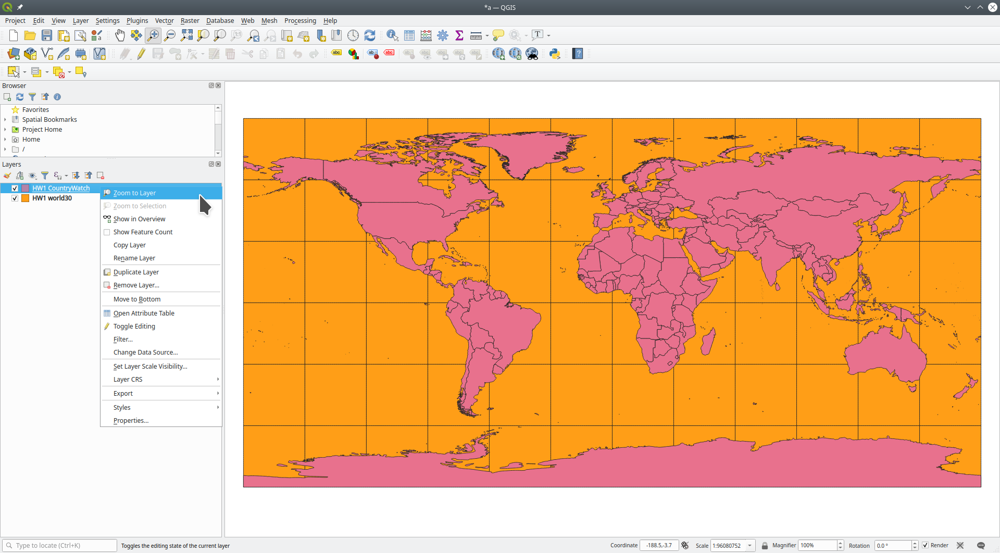
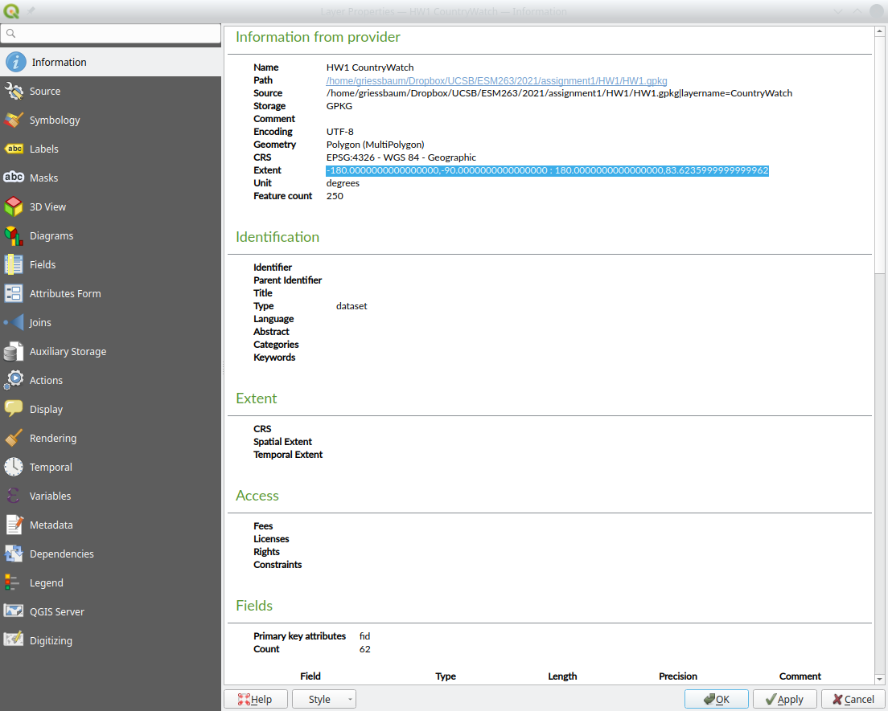
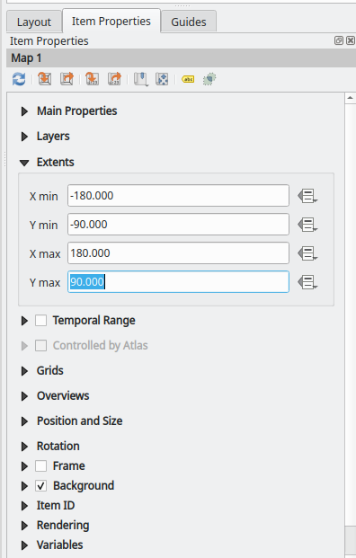

## Margins and frames in QGIS map layouts

Frequently asked question:

>  How do I reduce or remove the white space between the actual image of the map and its frame? There's a thick area of white space, and I'd like to have the map occupy that and have a frame immediately around it.

The way QGIS handles margins (and thus frames) in the layout is that it draws the frame around whatever you are viewing in your main window. You'll notice that if you zoom in a bit (e.g. just displaying  Africa) on the main window and then add the map, then there won't be any margin between the map and frame in your layout. 

When we use *Zoom to Layer* in the main window,  however, QGIS zooms to leave some margins between the map and the window boundaries. This makes ergonomic sense in the main window to communicate to the user that we are fully zoomed out, and no features are hidden outside the window boundaries. However, this is annoying in the layout window.

Toying around with the zoom level and the shape of your main window, you could get rid of the frame in the layout window. Try it out to get some feeling for the connection between main window and layout window. Yes, it's kinda cumbersome ...

A (somewhat) more graceful solution is to set the map item's extent in the layout manager exactly to the extent of the layer you are trying to display.

> An "extent" in GIS-speak is the range or "bounding box" of x and y coordinates occupied by a set of features.

We can find a layer's extent in its *Properties→Information* tab. For our *HW1_CountryWatch* dataset, the extent is (surprise!) from -180 degrees to +180 degrees horizontally and from -90 degrees to +84 degrees vertically. This should not really surprise us since we are looking at global data! (Ok, +84 degrees means that some parts of the globe in the arctic are not in the layer).

Next, jump back to the layout window. Select the map item. Select the *Item Properties* tab. Set the extents to `-180`, `-90`, `+180`, `+84`.

